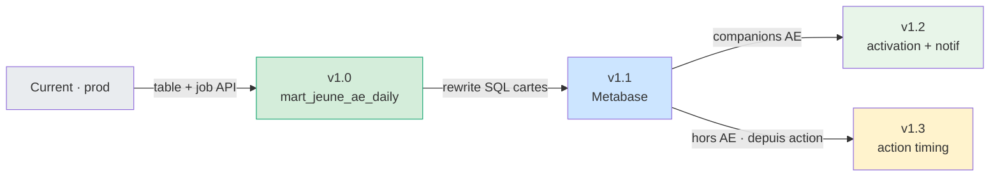
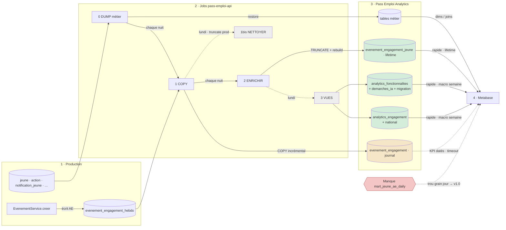
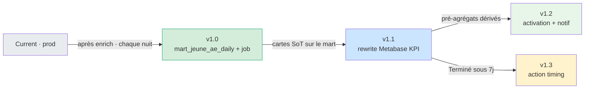
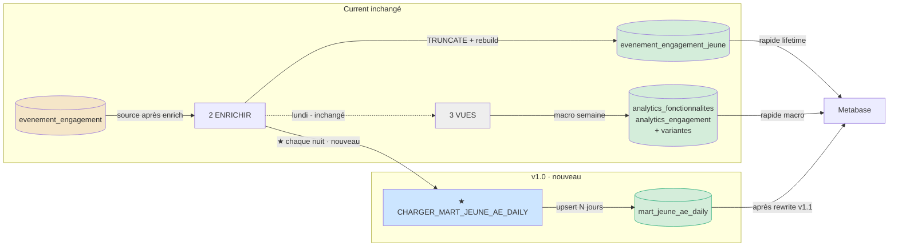
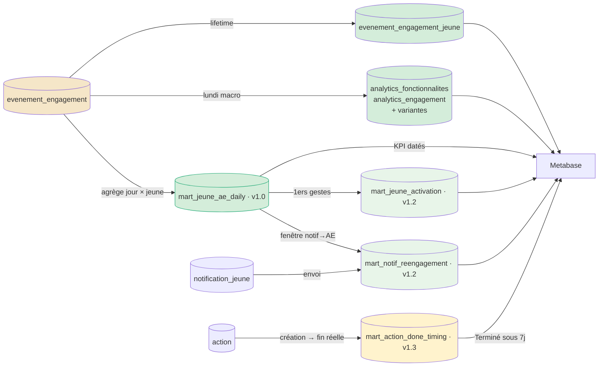

# Architecture analytics — état actuel et cible

## Introduction

Document d’**architecture** de la pipeline Analytics Pass Emploi : état **Current** (implémentation prod) et cible versionnée **v1.0 → v1.3** (tables mart pour dashboards Metabase).

**Contexte.** Les cartes Metabase Jeunes à grain daté (fréquence d’actes d’engagement, 1ers gestes, notif → AE, …) s’appuient encore sur des scans du journal Analytics `evenement_engagement`. Ce journal est la **source de vérité** d’usage (audit) ; ce n’est **pas** une couche dashboard. Les vues agrégées du lundi (`analytics_fonctionnalites`, `analytics_engagement`, variantes) et `evenement_engagement_jeune` couvrent déjà le macro semaine et le lifetime — **pas** le grain `(jeune, jour)`.

**Décision d’architecture.** Approche **additive** (ELT inchangé en amont) : créer des tables `mart_*` dans la base Analytics, alimentées par des jobs `pass-emploi-api` **après** `ENRICHIR_EVENEMENTS_ANALYTICS`, sans modifier le write path prod (`evenement_engagement_hebdo`) ni remplacer le journal. La réécriture des cartes Metabase est la version **v1.1** (hors ce repo).

| Public | Sections utiles |
|--------|-----------------|
| Développeurs `pass-emploi-api` | [Current](#current--état-précis-code), [v1.0](#v10--mart-daily-contrat), [Marts](#marts--jobs-nomenclature-schémas) |
| Analytics / auteurs Metabase | [Problème](#problème), [Versions](#versions-vue-densemble), [v1.1](#v11--metabase-hors-ce-repo) |
| Produit / revue | [Versions](#versions-vue-densemble), [Hors scope](#hors-scope) |

**Périmètre.** `pass-emploi-api` alimente la **base Analytics**. Metabase consomme cette base en aval (cf. [ANALYTICS.md](./ANALYTICS.md)).

**Références.** Runbook [ANALYTICS.md](./ANALYTICS.md) · [ADR-004](./decisions/ADR-004-pipeline-analytics.md) (ELT) · [ADR-005](./decisions/ADR-005-analytics-doc-metadata.md) (`@analytics.*`) · epic Metabase `01-jeunes-dashboards` (KPI, T16).

**Termes utilisés dans ce document**

| Terme | Sens |
|-------|------|
| Acte d’engagement (AE) | Événement d’usage tracé (`EvenementService.creer`) |
| Journal | Table Analytics `evenement_engagement` (cumul) |
| Hebdo / buffer prod | Table prod `evenement_engagement_hebdo` (seule table AE écrite en prod) |
| Enrich | Job `ENRICHIR_EVENEMENTS_ANALYTICS` (`jour`, géo, rebuild `evenement_engagement_jeune`) |
| Vues analytics | Tables `analytics_fonctionnalites*` / `analytics_engagement*` (lundi) |
| Mart | Table `mart_*` pré-agrégée pour dashboards (cible v1.x) |
| Current | Pipeline tel qu’implémenté aujourd’hui |

**Conventions de diagrammes.** Flèches libellées + couleurs + légende à pastilles ; pointillé = lundi ou chemin lent / gap ; noms de tables **en toutes lettres**.

---

## Table des matières

1. [Problème](#problème)
   - [Tables pré-agrégées (rappel)](#tables-pré-agrégées-rappel)
2. [Versions (vue d’ensemble)](#versions-vue-densemble)
3. [Current — état précis (code)](#current--état-précis-code)
   - [Faits à ne pas simplifier à tort](#faits-à-ne-pas-simplifier-à-tort)
   - [Chaîne d’ordonnancement](#chaîne-dordonnancement)
   - [Diagramme Current](#diagramme-current)
   - [Jobs Current (réels)](#jobs-current-réels)
   - [Couches Current](#couches-current)
4. [Build plan (fondé sur Current)](#build-plan-fondé-sur-current)
   - [v1.0 — mart daily (contrat)](#v10--mart-daily-contrat)
   - [v1.1 — Metabase (hors ce repo)](#v11--metabase-hors-ce-repo)
   - [v1.2 / v1.3 — companions](#v12--v13--companions)
   - [Chaîne jobs cible](#chaîne-jobs-cible-v10--v12--v13)
5. [Marts — jobs, nomenclature, schémas](#marts--jobs-nomenclature-schémas)
   - [Nomenclature](#nomenclature)
   - [Inventaire jobs mart (proposés)](#inventaire-jobs-mart-proposés)
   - [Schéma v1.0 — `mart_jeune_ae_daily`](#schéma-v10--mart_jeune_ae_daily-proposé)
   - [Schémas companions](#schémas-companions-proposés--à-figer-au-build)
     - [`mart_jeune_activation`](#v12--mart_jeune_activation)
     - [`mart_notif_reengagement`](#v12--mart_notif_reengagement)
     - [`mart_action_done_timing`](#v13--mart_action_done_timing)
   - [Récap flags](#récap-flags)
6. [Principes](#principes) · [Hors scope](#hors-scope)
7. [Liens](#liens)

---

## Problème

Le journal Analytics `evenement_engagement` est la **source de vérité** d’usage (audit). Ce n’est **pas** une API dashboard.

| Besoin Metabase | Couche adaptée | Aujourd’hui |
|-----------------|----------------|-------------|
| Macro semaine × structure × type | Vues `analytics_fonctionnalites` / `analytics_engagement` (+ variantes) · lundi | ✅ rapide |
| Lifetime / dernier AE | `evenement_engagement_jeune` | ✅ rapide |
| KPI **datés** jeune × jour | Mart `mart_jeune_ae_daily` | ❌ scan journal → lent / timeout |

### Tables pré-agrégées (rappel)

**`evenement_engagement_jeune`** — 1 ligne / jeune, agrégat lifetime (ex. date du dernier AE). Rebuild nightly dans le job enrich (`TRUNCATE` + reload depuis `evenement_engagement` + `evenement_engagement_YYYY`). Adapté aux KPI « actif / dernier AE » — **pas** à l’historique jour × jour.

**Vues analytics (lundi, job `CHARGER_LES_VUES_ANALYTICS`, semaine ISO N−1) :**

| Table | Rôle |
|-------|------|
| `analytics_fonctionnalites` | Usage fonctionnalités · catégorie/action × structure × type utilisateur × semaine |
| `analytics_fonctionnalites_demarches_ia` | Idem, bénéficiaires `DEMARCHES_IA` seulement |
| `analytics_fonctionnalites_migration` | Idem, utilisateurs liés à une migration |
| `analytics_engagement` | KPI engagement × structure × géo × semaine |
| `analytics_engagement_national` | Idem sans département/région (totaux nationaux) |

Rapides pour les dashboards **hebdomadaires / macro**. Ne couvrent pas le grain jeune × jour → `mart_jeune_ae_daily`.

---

## Versions (vue d’ensemble)

Ordre de livraison des couches. **Current** = pipeline prod. **v1.x** = cible versionnée.



**Légende :**
<span style="background:#e9ecef;border:1px solid #888;padding:0 0.55em">&nbsp;</span> Current (prod) ·
<span style="background:#d4edda;border:2px solid #2a7;padding:0 0.55em">&nbsp;</span> v1.0 ·
<span style="background:#cce5ff;border:1px solid #88a;padding:0 0.55em">&nbsp;</span> v1.1 Metabase ·
<span style="background:#e8f5e9;border:1px solid #8a8;padding:0 0.55em">&nbsp;</span> v1.2 ·
<span style="background:#fff3cd;border:1px solid #aa8;padding:0 0.55em">&nbsp;</span> v1.3

| Version | Contenu | Statut |
|---------|---------|--------|
| **Current** | Pipeline code ci-dessous | ✅ |
| **v1.0** | + `mart_jeune_ae_daily` après enrich | 🔲 premier build |
| **v1.1** | Rewrite SQL Metabase sur le mart | 🔲 juste après v1.0 |
| **v1.2** | + `mart_jeune_activation` + `mart_notif_reengagement` | 🔲 prévu |
| **v1.3** | + `mart_action_done_timing` (Terminé &lt;7j) | 🔲 prévu |

---

## Current — état précis (code)

Source de vérité code : `src/application/jobs/analytics/*` · cron `DUMP_ANALYTICS` `30 2 * * *` (`planificateur.ts`).

### Faits à ne pas simplifier à tort

1. **Prod n’a plus de table `evenement_engagement`.** Les actes d’engagement sont écrits dans **`evenement_engagement_hebdo`** (`EvenementSqlRepository`). La table pleine a été droppée en prod (migration 2023).
2. **Analytics `evenement_engagement`** = journal cumulé, alimenté **uniquement** par job 1 (COPY depuis prod `evenement_engagement_hebdo`).
3. **Job 0 dump** restaure le métier et **exclut** les tables `evenement_engagement*` (ne touche pas au journal Analytics).
4. **Lundi :** job 1 enfile **en parallèle** `NETTOYER` (truncate **prod** `evenement_engagement_hebdo`) **et** enrich ; enrich enfile les vues. 1bis n’attend pas enrich/vues.
5. **`evenement_engagement_jeune`** : chaque enrich = **TRUNCATE + rebuild** depuis `evenement_engagement_2022|_2023|_2024` **et** `evenement_engagement` (suffixe `''` = année courante).
6. **Tables `evenement_engagement_YYYY`** : créées hors chaîne quotidienne (`CREER_TABLES_AE_ANNUELLES`).

### Chaîne d’ordonnancement

```text
cron 02:30  DUMP_ANALYTICS                         # 0 · même si stderr dump
  └─► CHARGER_EVENEMENTS_ANALYTICS                 # 1 · COPY evenement_engagement_hebdo → evenement_engagement
        ├─► ENRICHIR_EVENEMENTS_ANALYTICS          # 2 · toujours
        │     └─► (lundi) CHARGER_LES_VUES_ANALYTICS  # 3 · semaine ISO N-1
        └─► (lundi) NETTOYER_EVENEMENTS_CHARGES_ANALYTICS  # 1bis · truncate evenement_engagement_hebdo PROD
```

### Diagramme Current

Prod (`evenement_engagement_hebdo` + tables métier) → jobs `pass-emploi-api` → tables Analytics → Metabase.  
Forward-only. Flèches pointillées = lundi **ou** chemin lent / gap (libellé sur la flèche).



**Légende :**
<span style="background:#f5e6c8;border:1px solid #a80;padding:0 0.55em">&nbsp;</span> `evenement_engagement` journal (lent si scanné) ·
<span style="background:#d4edda;border:1px solid #8a8;padding:0 0.55em">&nbsp;</span> pré-agrégat rapide ·
<span style="background:#eee;border:1px solid #888;padding:0 0.55em">&nbsp;</span> lundi only ·
<span style="background:#f5c6c6;border:2px solid #a33;padding:0 0.55em">&nbsp;</span> gap v1.0 ·
`- - →` lundi ou chemin lent / gap

*Hors schéma :* job 2 met aussi à jour `jour`/`semaine`/géo sur `evenement_engagement` et rebuild `evenement_engagement_jeune` depuis `evenement_engagement` + `evenement_engagement_YYYY` ; 1bis truncate **prod** `evenement_engagement_hebdo`.

### Jobs Current (réels)

| Fichier | JobType | Quand | Lit | Écrit |
|---------|---------|-------|-----|-------|
| `0-dump-for-analytics.job.ts` | `DUMP_ANALYTICS` | 02:30 | Prod métier | Analytics métier (excl. `evenement_engagement*`) |
| `1-charger-les-evenements.job.ts` | `CHARGER_EVENEMENTS_ANALYTICS` | après 0 | Prod **`evenement_engagement_hebdo`** | Analytics **`evenement_engagement`** (incrémental) |
| `1bis-nettoyer-….db.ts` | `NETTOYER_EVENEMENTS_CHARGES_ANALYTICS` | lundi après 1 | — | Truncate **prod** `evenement_engagement_hebdo` |
| `2-enrichir-les-evenements.job.ts` | `ENRICHIR_EVENEMENTS_ANALYTICS` | après 1 | `evenement_engagement` (+ `_YYYY`), jeune, agence… | `evenement_engagement` enrichi · **TRUNCATE+INSERT** `evenement_engagement_jeune` |
| `3-charger-les-vues.job.ts` | `CHARGER_LES_VUES_ANALYTICS` | lundi après 2 | `evenement_engagement` (+ métier pour filtres) | `analytics_fonctionnalites` · `analytics_fonctionnalites_demarches_ia` · `analytics_fonctionnalites_migration` · `analytics_engagement` · `analytics_engagement_national` |

### Couches Current

| Couche | Objet | Statut | Rôle |
|--------|--------|--------|------|
| Buffer prod | `evenement_engagement_hebdo` | ✅ | Seule table AE écrite en prod · truncatée lundi |
| Journal Analytics | `evenement_engagement` | ✅ | Cumul via COPY job 1 · SoT dashboards bruts |
| Archives annuelles | `evenement_engagement_2022|_2023|_2024` | ✅ | Hors cron · alimentent rebuild `evenement_engagement_jeune` |
| Lifetime | `evenement_engagement_jeune` | ✅ | Rebuild nightly |
| Macro | `analytics_fonctionnalites` · `analytics_fonctionnalites_demarches_ia` · `analytics_fonctionnalites_migration` · `analytics_engagement` · `analytics_engagement_national` | ✅ | Lundi · semaine N-1 |
| Métier | `jeune`, `action`, `notification_jeune`, … | ✅ | Dump job 0 |
| **Jour × jeune** | — | ❌ | Gap → v1.0 |

---

## Build plan (fondé sur Current)

Ordre de livraison : **Current → v1.0 → v1.1 → v1.2 / v1.3**.



**Légende :**
<span style="background:#e9ecef;border:1px solid #888;padding:0 0.55em">&nbsp;</span> Current ·
<span style="background:#d4edda;border:2px solid #2a7;padding:0 0.55em">&nbsp;</span> v1.0 (API) ·
<span style="background:#cce5ff;border:1px solid #88a;padding:0 0.55em">&nbsp;</span> v1.1 Metabase ·
<span style="background:#e8f5e9;border:1px solid #8a8;padding:0 0.55em">&nbsp;</span> v1.2 ·
<span style="background:#fff3cd;border:1px solid #aa8;padding:0 0.55em">&nbsp;</span> v1.3

| Version | Livrable | Repo | Dépend de | Pourquoi |
|---------|----------|------|-----------|----------|
| **v1.0** | Table `mart_jeune_ae_daily` + job après **enrich** (chaque nuit) | `pass-emploi-api` | Current (`jour` déjà écrit par enrich) | Trou grain jour · 3 KPI + funnels |
| **v1.1** | Rewrite Q1732 / Q1733 / Q1730 (+ funnels T15) · join `jeune` | Metabase / epics | v1.0 | Sans rewrite, la table n’améliore pas les boards |
| **v1.2** | `mart_jeune_activation` + `mart_notif_reengagement` | `pass-emploi-api` | v1.0 (+ v1.1 utile) | 1ers gestes + notif→AE pré-agrégés |
| **v1.3** | `mart_action_done_timing` | `pass-emploi-api` | Dump `action` (job 0) | Terminé &lt;7j · **pas** le mart AE · + couverture FT |

### v1.0 — mart daily (contrat)

Livrable API : table `mart_jeune_ae_daily` + job quotidien **après** `ENRICHIR_EVENEMENTS_ANALYTICS`. Seul delta pipeline en v1.0.

**Branchement :**

```text
… → ENRICHIR_EVENEMENTS_ANALYTICS
      → ★ CHARGER_MART_JEUNE_AE_DAILY          # NOUVEAU · chaque nuit
      → (lundi) CHARGER_LES_VUES_ANALYTICS     # inchangé
… → (lundi) NETTOYER_EVENEMENTS_CHARGES_ANALYTICS  # inchangé
```



**Légende :**
<span style="background:#f5e6c8;border:1px solid #a80;padding:0 0.55em">&nbsp;</span> `evenement_engagement` ·
<span style="background:#cce5ff;border:1px solid #88a;padding:0 0.55em">&nbsp;</span> nouveau job ·
<span style="background:#d4edda;border:2px solid #2a7;padding:0 0.55em">&nbsp;</span> `mart_jeune_ae_daily` ·
<span style="background:#d4edda;border:1px solid #8a8;padding:0 0.55em">&nbsp;</span> pré-agrégat inchangé ·
<span style="background:#eee;border:1px solid #888;padding:0 0.55em">&nbsp;</span> / `- - →` lundi

| Élément | Action |
|---------|--------|
| Jobs 0 / 1 / 1bis / 2 / 3 | Inchangés · enrich **ajoute** l’enqueue mart |
| Source mart | Analytics `evenement_engagement` **après** enrich (`jour` renseigné) · filtre `JEUNE` |
| Backfill large | Optionnel via `evenement_engagement_YYYY` + task |
| Grain | `(id_utilisateur, jour)` si ≥1 acte d’engagement |
| Dims | **Pas** de structure dénorm · join `jeune` en Metabase |
| Refresh | Upsert **N** derniers jours (3–7) |
| Doc | [ANALYTICS.md](./ANALYTICS.md) + `@analytics.*` (ADR-005) |
| Critère | « jours AE 30–90 j » &lt; 2 s après backfill |
| JobType / fichier | À figer avec owners (forme `CHARGER_MART_JEUNE_AE_DAILY`) |

### v1.1 — Metabase (hors ce repo)

Réécriture des cartes source de vérité pour lire le mart (+ `jeune` / `notification_jeune`) : fréquence AE, 1ers gestes sous 7j, notif→AE ; puis funnels datés (T15). Sans v1.1, v1.0 n’améliore pas les boards.

### v1.2 / v1.3 — companions

Marts optionnels **après** v1.0 si les fenêtres / timings doivent être pré-calculés (activation, notif→AE, Terminé &lt;7j).



**Légende :**
<span style="background:#f5e6c8;border:1px solid #a80;padding:0 0.55em">&nbsp;</span> `evenement_engagement` ·
<span style="background:#d4edda;border:1px solid #8a8;padding:0 0.55em">&nbsp;</span> `evenement_engagement_jeune` / tables analytics ·
<span style="background:#d4edda;border:2px solid #2a7;padding:0 0.55em">&nbsp;</span> v1.0 ·
<span style="background:#e8f5e9;border:1px solid #8a8;padding:0 0.55em">&nbsp;</span> v1.2 ·
<span style="background:#fff3cd;border:1px solid #aa8;padding:0 0.55em">&nbsp;</span> v1.3 (source `action`)

**Non retenus** (SoT historique) : `mart_jeune_persona_daily`, `mart_funnel_offres_daily`, `mart_retention_cohorts`, `mart_reco_resultat`.

### Chaîne jobs cible (v1.0 + v1.2 + v1.3)

```text
0 dump → 1 COPY evenement_engagement_hebdo → evenement_engagement
         → 2 enrich (+ rebuild evenement_engagement_jeune)
                              → ★ mart_jeune_ae_daily       # v1.0 · quotidien
                              → ★ mart_jeune_activation     # v1.2
                              → ★ mart_notif_reengagement   # v1.2
                              → ★ mart_action_done_timing   # v1.3 · depuis action
                              → 3 vues analytics_fonctionnalites / analytics_engagement (+ variantes)  # lundi · inchangé
         → (lundi) 1bis nettoyer evenement_engagement_hebdo prod  # inchangé
```

---

## Marts — jobs, nomenclature, schémas

Contrats proposés pour les tables `mart_*` et jobs associés (à figer au build avec les owners).

### Nomenclature

| Règle | Exemple |
|-------|---------|
| Préfixe table | `mart_` = agrégat dashboard (≠ `evenement_engagement`, ≠ tables `analytics_fonctionnalites` / `analytics_engagement`) |
| Suite | `{entité}_{objet}_{grain?}` |
| Grain explicite | `_daily` = 1 ligne / jour (quand pertinent) |
| JobType | `CHARGER_MART_{OBJET}` (même famille que `CHARGER_LES_VUES_ANALYTICS`) |
| Fichier | `{n}-charger-mart-….job.ts` sous `src/application/jobs/analytics/` |
| Metadata | `@analytics.*` (ADR-005) |

### Inventaire jobs mart (proposés)

| Version | JobType (proposé) | Table | Quand | Lit | Écrit / grain | Description |
|---------|-------------------|-------|-------|-----|---------------|-------------|
| **v1.0** | `CHARGER_MART_JEUNE_AE_DAILY` | `mart_jeune_ae_daily` | Chaque nuit **après enrich** | `evenement_engagement` (filtre `JEUNE`, `jour` renseigné) | Upsert N j · PK `(id_utilisateur, jour)` | Agrège AE → volume + flags gestes **une fois** dans le job |
| **v1.2** | `CHARGER_MART_JEUNE_ACTIVATION` | `mart_jeune_activation` | Après mart daily | `mart_jeune_ae_daily` + `jeune` | 1 ligne / jeune | Premières dates de gestes + bool « sous 7j après 1ère connexion » |
| **v1.2** | `CHARGER_MART_NOTIF_REENGAGEMENT` | `mart_notif_reengagement` | Après dump + mart daily | `notification_jeune` × daily | 1 ligne / notification | Notif → AE dans fenêtre 7j (sans scan ad hoc Metabase) |
| **v1.3** | `CHARGER_MART_ACTION_DONE_TIMING` | `mart_action_done_timing` | Après dump (job 0) | **`action`** (pas `evenement_engagement`) | 1 ligne / action (ou jeune × action) | Création → `date_fin_reelle` · flag Terminé &lt;7j · couverture FT à clarifier |

v1.1 = **pas de job** dans ce repo (rewrite Metabase uniquement).

### Schéma v1.0 — `mart_jeune_ae_daily` (proposé)

**Description :** 1 ligne / jeune / jour calendaire avec ≥1 acte d’engagement (`JEUNE`). Remplace les scans Metabase sur le journal pour KPI datés (fréquence jours AE, 1ers gestes, funnels, notif→AE via join).

**Flags gestes (oui — calculés dans le job, pas en Metabase) :**

| Flag | Vrai si ≥1 code AE ce jour |
|------|----------------------------|
| `has_recherche_offre` | `OFFRE_*_RECHERCHEE` |
| `has_offre` | `OFFRE_*_AFFICHEE` |
| `has_postuler` | `OFFRE_*_POSTULEE` |
| `has_action` | `ACTION_CREEE*` |
| `has_rdv` | `RDV_DETAIL`, `RDV_DETAIL_SESSION` |
| `has_evenement` | `SESSION_AFFICHEE`, `EVENEMENT_EXTERNE_*`, `ANIMATION_COLLECTIVE_AFFICHEE` |

```sql
CREATE TABLE mart_jeune_ae_daily (
  id_utilisateur          text        NOT NULL,
  jour                    date        NOT NULL,
  nb_ae                   integer     NOT NULL DEFAULT 0,
  has_recherche_offre     boolean     NOT NULL DEFAULT false,
  has_offre               boolean     NOT NULL DEFAULT false,
  has_postuler            boolean     NOT NULL DEFAULT false,
  has_action              boolean     NOT NULL DEFAULT false,
  has_rdv                 boolean     NOT NULL DEFAULT false,
  has_evenement           boolean     NOT NULL DEFAULT false,
  updated_at              timestamptz NOT NULL DEFAULT now(),
  PRIMARY KEY (id_utilisateur, jour)
);

CREATE INDEX ON mart_jeune_ae_daily (jour);
```

**Nouveau vs Current :** table + job absents aujourd’hui. Pas de dénorm structure (join `jeune` en Metabase). Listes exactes de codes : epic Metabase `AE-CODES.md` / carte 1ers gestes.

### Schémas companions (proposés — à figer au build)

Companions = tables **après** v1.0 si les cartes restent trop lourdes ou si on veut pré-calculer des fenêtres.  
Ils **ne recalculent pas** les flags gestes AE (`has_offre`, …) : ceux-ci restent sur `mart_jeune_ae_daily`.  
Ils portent leurs **propres flags de fenêtre / résultat** (booléens de timing).

---

#### v1.2 — `mart_jeune_activation`

**Description :** 1 ligne / jeune. Pré-agrège les **premières dates** de gestes (depuis les flags daily) et les booléens « geste sous 7j après 1ère connexion » pour la carte Activation — sans `MIN(jour) FILTER` ad hoc en Metabase.

| | |
|--|--|
| **Source** | `mart_jeune_ae_daily` + `jeune.date_premiere_connexion` |
| **Grain** | 1 ligne / `id_utilisateur` |
| **Débloque** | 1ers gestes sous 7j (version pré-calculée) |
| **Flags gestes AE** | Non (réutilise `has_*` du daily via `MIN(jour) WHERE has_…`) |
| **Flags propres** | Oui — fenêtre 7j après connexion |

| Colonne (proposée) | Type | Exist? | Sens |
|--------------------|------|--------|------|
| `id_utilisateur` | text PK | false | Jeune |
| `date_premiere_connexion` | date | false | Copie depuis `jeune` |
| `first_offre` | date null | false | `MIN(jour)` où `has_offre` |
| `first_action` | date null | false | `MIN(jour)` où `has_action` |
| `first_rdv` | date null | false | `MIN(jour)` où `has_rdv` |
| `first_evenement` | date null | false | `MIN(jour)` où `has_evenement` |
| `geste_offre_sous_7j` | boolean | true | `first_offre` ∈ [connexion, connexion+7) |
| `geste_action_sous_7j` | boolean | true | idem `first_action` |
| `geste_rdv_sous_7j` | boolean | true | idem `first_rdv` |
| `geste_evenement_sous_7j` | boolean | true | idem `first_evenement` |
| `updated_at` | timestamptz | false | Refresh job |

---

#### v1.2 — `mart_notif_reengagement`

**Description :** 1 ligne / notification push. Pré-calcule si le jeune a eu ≥1 jour AE (et optionnellement une reconnexion) dans les 7 jours après l’envoi — pour la carte Notif → revenu AE.

| | |
|--|--|
| **Source** | `notification_jeune` × `mart_jeune_ae_daily` (+ optionnel `jeune.date_derniere_connexion`) |
| **Grain** | 1 ligne / `id_notification` |
| **Débloque** | Notif → AE sous 7j sans jointure fenêtre en Metabase |
| **Flags gestes AE** | Non (présence AE = n’importe quelle ligne daily dans la fenêtre) |
| **Flags propres** | Oui — résultat dans la fenêtre 7j |

| Colonne (proposée) | Type | Exist? | Sens |
|--------------------|------|--------|------|
| `id_notification` | text PK | false | Depuis `notification_jeune` |
| `id_jeune` | text | false | Destinataire |
| `date_notification` | timestamptz | false | Envoi |
| `has_ae_sous_7j` | boolean | true | ≥1 ligne `mart_jeune_ae_daily` dans [notif, notif+7j) |
| `premier_jour_ae_apres` | date null | false | Premier `jour` AE dans la fenêtre |
| `has_reconnexion_sous_7j` | boolean | true | Optionnel · reconnexion dans la même fenêtre |
| `updated_at` | timestamptz | false | Refresh job |

---

#### v1.3 — `mart_action_done_timing`

**Description :** 1 ligne / action. Mesure le délai création → `date_fin_reelle` pour **Terminé &lt;7j**. Source métier `action` (dump job 0) — **pas** `evenement_engagement`. Couverture FT / PE quasi vide aujourd’hui (volume surtout MILO) à clarifier.

| | |
|--|--|
| **Source** | `action` (+ dims jeune / structure si besoin) |
| **Grain** | 1 ligne / `id_action` |
| **Débloque** | KPI Terminé sous 7j (+ suivi couverture FT) |
| **Flags gestes AE** | Non (hors AE) |
| **Flags propres** | Oui — terminé dans la fenêtre 7j |

| Colonne (proposée) | Type | Exist? | Sens |
|--------------------|------|--------|------|
| `id_action` | text PK | false | Action |
| `id_jeune` | text | false | Bénéficiaire |
| `date_creation` | timestamptz | false | Début |
| `date_fin_reelle` | timestamptz null | false | Terminée (null = pas encore) |
| `termine_sous_7j` | boolean | true | `date_fin_reelle` ∈ [création, création+7) |
| `structure` / dispositif | text null | false | Distinguer MILO vs FT |
| `updated_at` | timestamptz | false | Refresh job |

### Récap flags

| Table | Flags gestes AE (`has_offre`, …) | Flags fenêtre / résultat |
|-------|----------------------------------|--------------------------|
| `mart_jeune_ae_daily` | ✅ 6 flags + `nb_ae` | — |
| `mart_jeune_activation` | ❌ dérivés du daily | ✅ `geste_*_sous_7j` (×4) |
| `mart_notif_reengagement` | ❌ | ✅ `has_ae_sous_7j` (+ optionnel reconnexion) |
| `mart_action_done_timing` | ❌ hors AE | ✅ `termine_sous_7j` |

DDL / codes AE détaillés : epic Metabase `ARCHITECTURE-MART.md` + T16.

---

## Principes

1. **Additif** — pas de rewrite du write path prod (`evenement_engagement_hebdo`) ni du journal Analytics (`evenement_engagement`).
2. Flags AE → familles **dans le job**, pas dans chaque carte Metabase.
3. Dims : join `jeune` en v1.0.
4. Même famille de jobs que `CHARGER_LES_VUES_ANALYTICS` · tables et cadences différentes.
5. Analytics `evenement_engagement` ← **uniquement** COPY depuis `evenement_engagement_hebdo` (job 1).
6. `evenement_engagement_jeune` = rebuild nightly (TRUNCATE).

### Hors scope

- Sémantique Actif 30j / AE (PO)
- Board live AARRI bénéficiaires
- Remplacer les vues `analytics_fonctionnalites` / `analytics_engagement` (et variantes) ou `evenement_engagement_jeune`

DDL / codes AE / ticket : epic Metabase `01-jeunes-dashboards` (`ARCHITECTURE-MART.md`, T16).

---

## Liens

| Doc | Rôle |
|-----|------|
| [ANALYTICS.md](./ANALYTICS.md) | Runbook |
| [ADR-004](./decisions/ADR-004-pipeline-analytics.md) | Pourquoi ELT |
| [ADR-005](./decisions/ADR-005-analytics-doc-metadata.md) | Metadata jobs |
| Epic Metabase `01-jeunes-dashboards` | KPI, timings, T16 |
