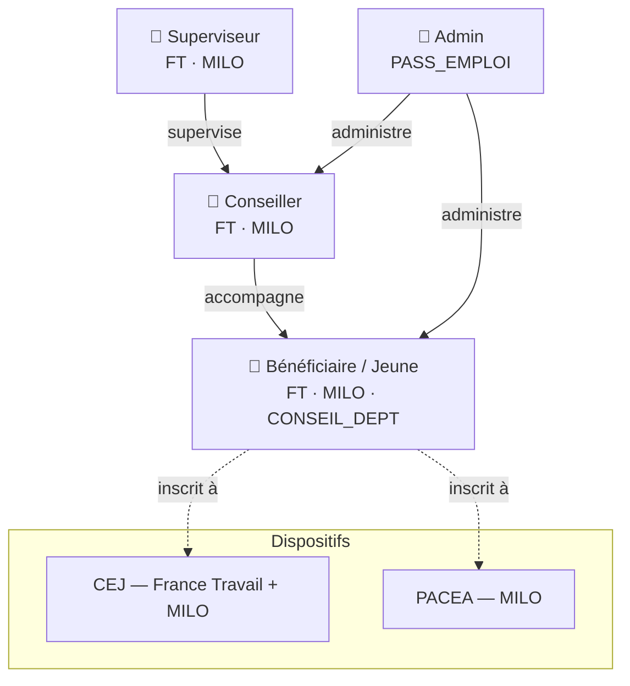
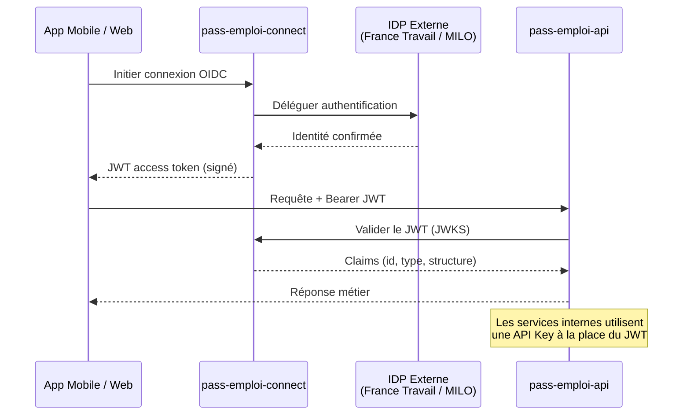
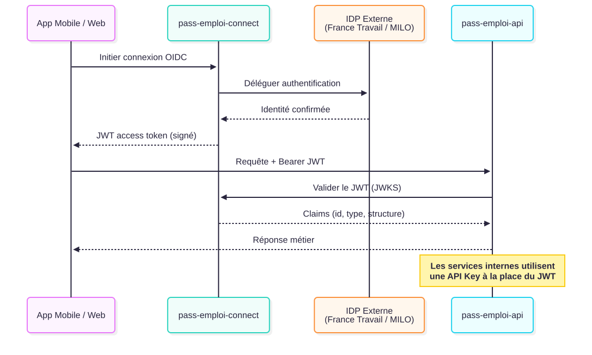
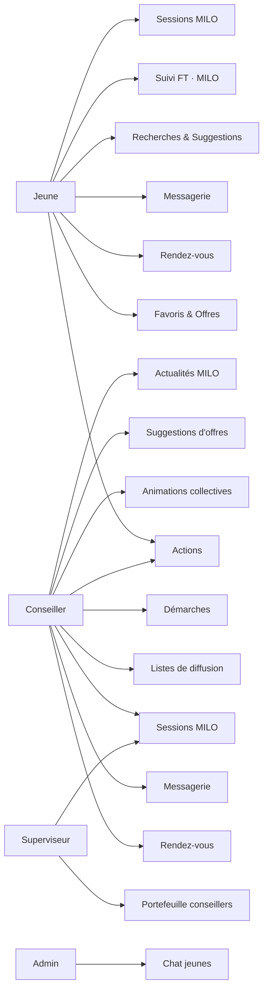
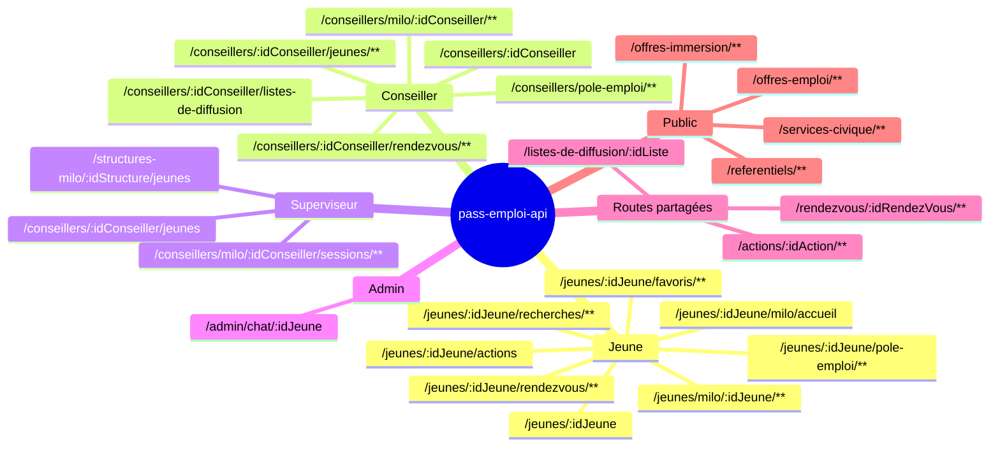

# Acteurs et Routes — pass-emploi-api

> Point d'entrée pour comprendre qui fait quoi dans l'API.
> Pour le détail des routes, consulte le fichier de ton acteur.

## Les acteurs

pass-emploi-api sert 4 types d'utilisateurs authentifiés et un ensemble de routes publiques.

| Acteur | App | Structure | Authentification |
|---|---|---|---|
| **Bénéficiaire / Jeune** | App mobile Flutter | FT, MILO, CONSEIL_DEPT | JWT OIDC via pass-emploi-connect |
| **Conseiller** | Web Next.js | FT (POLE_EMPLOI), MILO | JWT OIDC via pass-emploi-connect |
| **Superviseur** | Web Next.js | FT, MILO | JWT OIDC via pass-emploi-connect |
| **Admin** | Outils internes | PASS_EMPLOI | API Key (header `Authorization: Bearer`) |

---

## Diagramme 1 — Relations entre acteurs

---

## Diagramme 2 — Flux d'authentification

---

## Diagramme 3 — Matrice acteurs × domaines

---

## Diagramme 4 — Mindmap des routes principales

---

## Navigation

| Acteur | Fichier |
|---|---|
| Bénéficiaire / Jeune | [jeune.md](./jeune.md) |
| Conseiller | [conseiller.md](./conseiller.md) |
| Superviseur | [superviseur.md](./superviseur.md) |
| Admin | [admin.md](./admin.md) |
