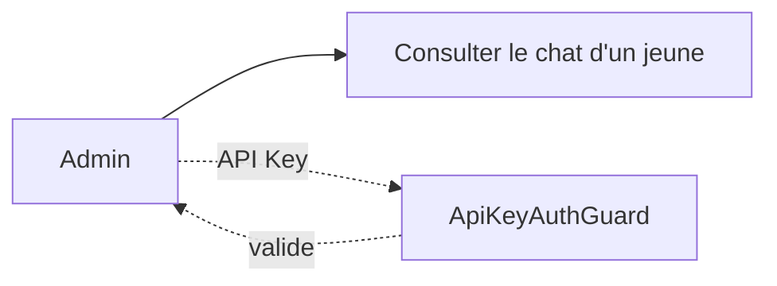
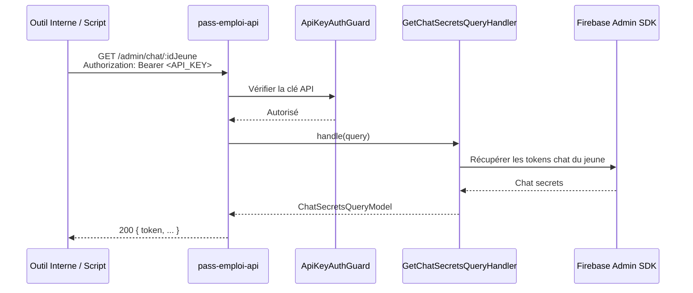

# Admin

## Qui est-il ?

L'admin représente les services internes de l'équipe pass-emploi (scripts, outils, support).
Il n'utilise **pas de JWT OIDC** : l'authentification se fait via une **API Key** transmise dans le header `Authorization: Bearer <key>`.

La clé est stockée dans les variables d'environnement (via `ConfigService`, jamais en dur).

---

## Diagramme de capacités

---

## Routes

| Méthode | Endpoint | Description |
|---|---|---|
| `GET` | `/admin/chat/:idJeune` | Récupérer les informations de chat d'un jeune (secrets Firebase) |

> Ces routes sont protégées par `ApiKeyAuthGuard` (pas OIDC). L'accès est réservé aux outils internes.

---

## Séquence : Consulter le chat d'un jeune

