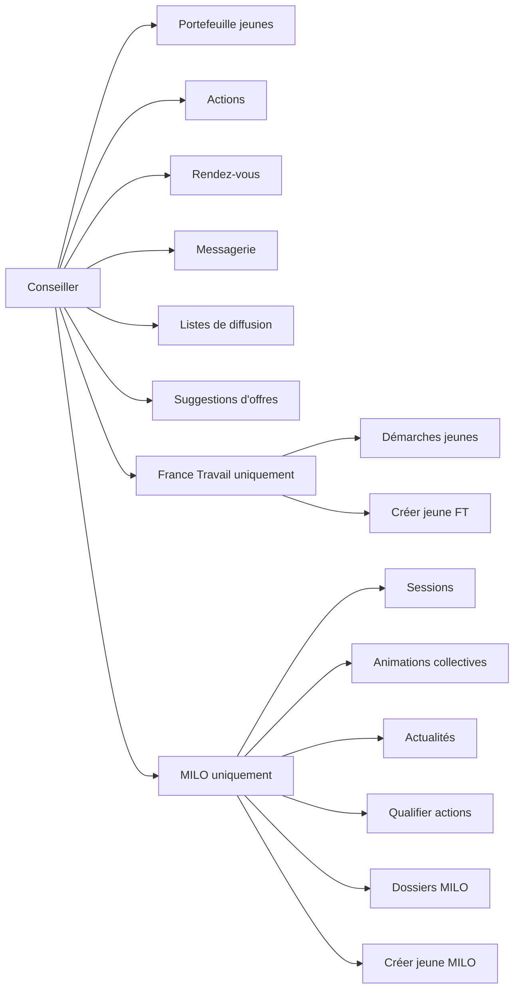
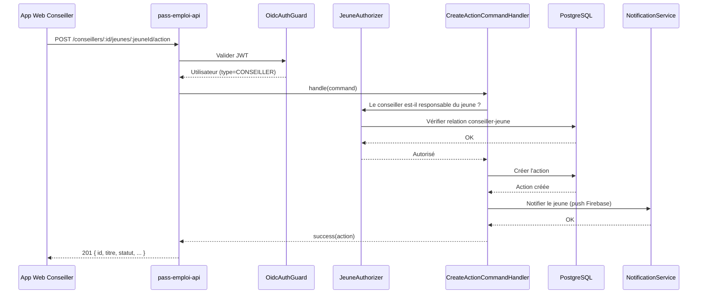

# Conseiller

## Qui est-il ?

Le conseiller est le professionnel qui accompagne les bénéficiaires. Il utilise **l'application web Next.js**.
Il appartient à une structure (France Travail ou Mission Locale) et gère un portefeuille de jeunes.

Deux profils distincts selon la structure :
- **France Travail (POLE_EMPLOI)** : démarches, suggestions d'offres, suivi FT
- **MILO** : sessions, animations collectives, actualités, qualification d'actions

---

## Diagramme de capacités

---

## Routes

### Gestion du portefeuille

| Méthode | Endpoint | Description |
|---|---|---|
| `GET` | `/conseillers` | Rechercher des conseillers (par email ou nom) |
| `GET` | `/conseillers/:idConseiller` | Détail d'un conseiller |
| `PUT` | `/conseillers/:idConseiller` | Modifier les informations du conseiller |
| `DELETE` | `/conseillers/:idConseiller` | Supprimer un conseiller |
| `GET` | `/conseillers/:idConseiller/jeunes` | Lister les jeunes du portefeuille |
| `GET` | `/conseillers/:idConseiller/jeunes/comptage` | Comptage des jeunes |
| `GET` | `/conseillers/:idConseiller/jeunes/identites` | Identités des jeunes (nom, prénom) |
| `GET` | `/conseillers/:idConseiller/jeunes/:idJeune/indicateurs` | Indicateurs d'un jeune |
| `PATCH` | `/conseillers/:idConseiller/jeunes/:idJeune` | Modifier les données d'un jeune |
| `POST` | `/conseillers/:idConseiller/jeunes/:idJeune/changer-dispositif` | Changer le dispositif d'un jeune |
| `POST` | `/conseillers/:idConseiller/recuperer-mes-jeunes` | Récupérer ses jeunes (après transfert) |
| `POST` | `/conseillers/:idConseiller/envoyer-email-activation/:idJeune` | Envoyer l'email d'activation à un jeune |

### Actions

| Méthode | Endpoint | Description |
|---|---|---|
| `POST` | `/conseillers/:idConseiller/jeunes/:idJeune/action` | Créer une action pour un jeune |
| `GET` | `/v2/conseillers/:idConseiller/actions` | Lister les actions du portefeuille (v2) |
| `GET` | `/actions/:idAction` | Détail d'une action |
| `PUT` | `/actions/:idAction` | Mettre à jour une action |
| `DELETE` | `/actions/:idAction` | Supprimer une action |
| `POST` | `/actions/:idAction/qualifier` | Qualifier une action |
| `POST` | `/actions/:idAction/commentaires` | Ajouter un commentaire à une action |
| `GET` | `/actions/:idAction/commentaires` | Lister les commentaires d'une action |

### Rendez-vous

| Méthode | Endpoint | Description |
|---|---|---|
| `POST` | `/conseillers/:idConseiller/rendezvous` | Créer un rendez-vous |
| `GET` | `/v2/conseillers/:idConseiller/rendezvous` | Lister les rendez-vous (v2) |
| `GET` | `/conseillers/:idConseiller/rendezvous/a-clore` | Lister les rendez-vous à clore |
| `GET` | `/conseillers/:idConseiller/jeunes/:idJeune/rendezvous` | RDV d'un jeune du portefeuille |
| `GET` | `/rendezvous/:idRendezVous` | Détail d'un rendez-vous |
| `PUT` | `/rendezvous/:idRendezVous` | Modifier un rendez-vous |
| `DELETE` | `/rendezvous/:idRendezVous` | Supprimer un rendez-vous |
| `POST` | `/rendezvous/:idRendezVous/clore` | Clore un rendez-vous |

### Messagerie

| Méthode | Endpoint | Description |
|---|---|---|
| `POST` | `/conseillers/:idConseiller/jeunes/notify-messages` | Envoyer des notifications de messages |

### Listes de diffusion

| Méthode | Endpoint | Description |
|---|---|---|
| `POST` | `/conseillers/:idConseiller/listes-de-diffusion` | Créer une liste de diffusion |
| `GET` | `/conseillers/:idConseiller/listes-de-diffusion` | Lister les listes de diffusion |
| `GET` | `/listes-de-diffusion/:idListeDeDiffusion` | Détail d'une liste |
| `PUT` | `/listes-de-diffusion/:idListeDeDiffusion` | Modifier une liste |
| `DELETE` | `/listes-de-diffusion/:idListeDeDiffusion` | Supprimer une liste |

### Suggestions d'offres

| Méthode | Endpoint | Description |
|---|---|---|
| `POST` | `/conseillers/:idConseiller/recherches/suggestions/offres-emploi` | Suggérer des offres emploi à un jeune |
| `POST` | `/conseillers/:idConseiller/recherches/suggestions/immersions` | Suggérer des immersions à un jeune |
| `POST` | `/conseillers/:idConseiller/recherches/suggestions/services-civique` | Suggérer des services civique |

### France Travail uniquement

| Méthode | Endpoint | Description |
|---|---|---|
| `POST` | `/conseillers/pole-emploi/jeunes` | Créer un jeune France Travail |
| `POST` | `/conseillers/pole-emploi/verifier-email-beneficiaire` | Vérifier l'email d'un bénéficiaire |
| `GET` | `/conseillers/:idConseiller/jeunes/:idJeune/demarches` | Démarches d'un jeune |

### MILO uniquement

| Méthode | Endpoint | Description |
|---|---|---|
| `POST` | `/conseillers/milo/jeunes` | Créer un jeune MILO |
| `GET` | `/conseillers/milo/dossiers/:idDossier` | Récupérer un dossier MILO |
| `GET` | `/conseillers/milo/jeunes/:idDossier` | Récupérer un jeune MILO par son dossier |
| `GET` | `/conseillers/milo/:idConseiller/sessions` | Lister les sessions du conseiller |
| `GET` | `/conseillers/milo/:idConseiller/agenda/sessions` | Agenda des sessions |
| `GET` | `/conseillers/milo/:idConseiller/sessions/:idSession` | Détail d'une session |
| `PATCH` | `/conseillers/milo/:idConseiller/sessions/:idSession` | Modifier la visibilité d'une session |
| `POST` | `/conseillers/milo/:idConseiller/sessions/:idSession/cloturer` | Clôturer une session (émargement) |
| `POST` | `/conseillers/milo/actions/qualifier` | Qualifier des actions en lot |
| `GET` | `/conseillers/milo/:idConseiller/compteurs-portefeuille` | Compteurs du portefeuille MILO |
| `POST` | `/conseillers/milo/:idConseiller/actualites` | Créer une actualité MILO |
| `GET` | `/conseillers/milo/:idConseiller/actualites` | Lister les actualités MILO |
| `PUT` | `/conseillers/milo/:idConseiller/actualites/:idActualite` | Modifier une actualité MILO |
| `DELETE` | `/conseillers/milo/:idConseiller/actualites/:idActualite` | Supprimer une actualité MILO |

---

## Séquence : Créer une action pour un jeune

