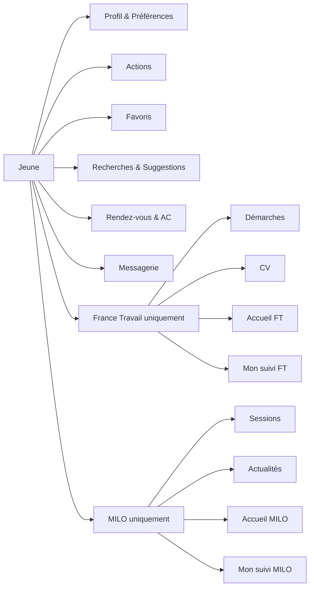
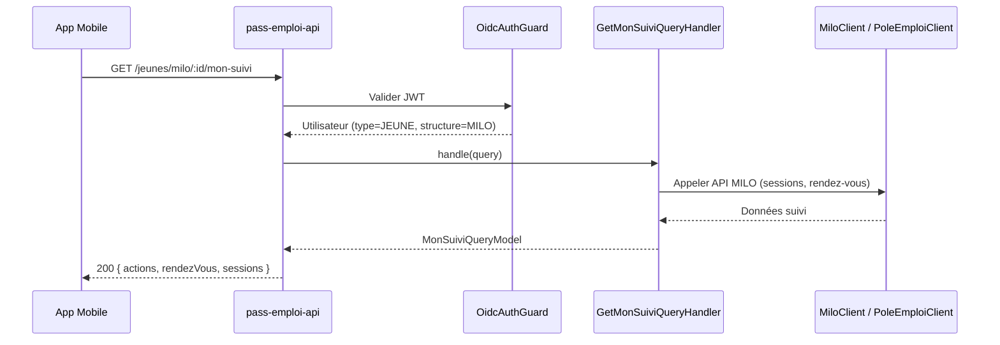
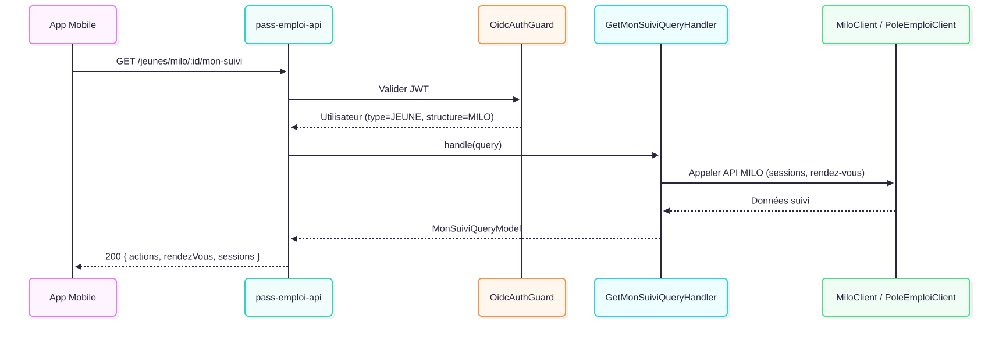

# Bénéficiaire / Jeune

## Qui est-il ?

Le jeune (bénéficiaire) est l'utilisateur principal de **l'application mobile Flutter**.
Il est inscrit à un dispositif d'accompagnement (CEJ ou PACEA) et est suivi par un conseiller.

Selon sa structure d'appartenance, il a accès à des fonctionnalités différentes :
- **FT (POLE_EMPLOI)** : démarches, CV, accueil France Travail
- **MILO** : sessions, actualités, accueil MILO

---

## Diagramme de capacités

---

## Routes

### Profil & Configuration

| Méthode | Endpoint | Description |
|---|---|---|
| `GET` | `/jeunes/:idJeune` | Récupérer le détail d'un jeune |
| `PATCH` | `/jeunes/:idJeune` | Mettre à jour les infos du jeune |
| `GET` | `/jeunes/:idJeune/preferences` | Récupérer les préférences du jeune |
| `PUT` | `/jeunes/:idJeune/preferences` | Mettre à jour les préférences |
| `PUT` | `/jeunes/:idJeune/configuration-application` | Configurer l'application mobile (push token, etc.) |
| `GET` | `/jeunes/:idJeune/conseillers` | Récupérer les conseillers du jeune |
| `GET` | `/jeunes/:idJeune/notifications` | Récupérer les notifications du jeune |
| `GET` | `/jeunes/:idJeune/comptage` | Récupérer le comptage des activités |

### Actions

| Méthode | Endpoint | Description |
|---|---|---|
| `GET` | `/jeunes/:idJeune/actions` | Lister les actions du jeune |
| `POST` | `/jeunes/:idJeune/action` | Créer une nouvelle action |
| `GET` | `/jeunes/:idJeune/home/agenda` | Récupérer l'agenda (page d'accueil) |

### Actions — détail et gestion

Ces routes utilisent l'ID de l'action directement et sont accessibles aussi bien par le jeune que par son conseiller.

| Méthode | Endpoint | Description |
|---|---|---|
| `GET` | `/actions/:idAction` | Récupérer le détail d'une action |
| `PUT` | `/actions/:idAction` | Mettre à jour une action |
| `DELETE` | `/actions/:idAction` | Supprimer une action |
| `GET` | `/actions/:idAction/commentaires` | Lister les commentaires d'une action |
| `POST` | `/actions/:idAction/commentaires` | Ajouter un commentaire à une action |

### Favoris & Offres

| Méthode | Endpoint | Description |
|---|---|---|
| `GET` | `/jeunes/:idJeune/favoris` | Récupérer tous les favoris |
| `GET` | `/jeunes/:idJeune/favoris/offres-emploi` | Favoris offres d'emploi |
| `GET` | `/jeunes/:idJeune/favoris/offres-immersion` | Favoris immersions |
| `GET` | `/jeunes/:idJeune/favoris/services-civique` | Favoris services civique |
| `GET` | `/jeunes/:idJeune/favoris/metadonnees` | Métadonnées des favoris |
| `POST` | `/jeunes/:idJeune/favoris/offres-emploi` | Ajouter un favori offre emploi |
| `POST` | `/jeunes/:idJeune/favoris/offres-immersion` | Ajouter un favori immersion |
| `POST` | `/jeunes/:idJeune/favoris/services-civique` | Ajouter un favori service civique |
| `PATCH` | `/jeunes/:idJeune/favoris/offres-emploi/:idOffre` | Mettre à jour un favori emploi |
| `PATCH` | `/jeunes/:idJeune/favoris/offres-immersion/:idOffre` | Mettre à jour un favori immersion |
| `PATCH` | `/jeunes/:idJeune/favoris/service-civique/:idOffre` | Mettre à jour un favori service civique |
| `DELETE` | `/jeunes/:idJeune/favoris/offres-emploi/:idOffreEmploi` | Supprimer un favori emploi |
| `DELETE` | `/jeunes/:idJeune/favoris/offres-immersion/:idOffreImmersion` | Supprimer un favori immersion |
| `DELETE` | `/jeunes/:idJeune/favoris/services-civique/:idOffre` | Supprimer un favori service civique |

### Recherches & Suggestions

| Méthode | Endpoint | Description |
|---|---|---|
| `GET` | `/jeunes/:idJeune/recherches` | Lister les recherches sauvegardées |
| `POST` | `/jeunes/:idJeune/recherches/offres-emploi` | Sauvegarder une recherche emploi |
| `POST` | `/jeunes/:idJeune/recherches/immersions` | Sauvegarder une recherche immersion |
| `POST` | `/jeunes/:idJeune/recherches/services-civique` | Sauvegarder une recherche service civique |
| `DELETE` | `/jeunes/:idJeune/recherches/:idRecherche` | Supprimer une recherche |
| `GET` | `/jeunes/:idJeune/recherches/suggestions` | Récupérer les suggestions du conseiller |
| `POST` | `/jeunes/:idJeune/recherches/suggestions/:idSuggestion/accepter` | Accepter une suggestion |
| `POST` | `/jeunes/:idJeune/recherches/suggestions/:idSuggestion/refuser` | Refuser une suggestion |

### Rendez-vous & Messagerie

| Méthode | Endpoint | Description |
|---|---|---|
| `GET` | `/jeunes/:idJeune/rendezvous/:idRendezVous` | Détail d'un rendez-vous |
| `GET` | `/jeunes/:idJeune/animations-collectives` | Lister les animations collectives |
| `GET` | `/jeunes/:idJeune/messages` | Rechercher dans les messages |

### France Travail uniquement

| Méthode | Endpoint | Description |
|---|---|---|
| `GET` | `/jeunes/:idJeune/pole-emploi/accueil` | Page d'accueil France Travail |
| `GET` | `/jeunes/:idJeune/pole-emploi/cv` | CV France Travail |
| `GET` | `/jeunes/:idJeune/pole-emploi/mon-suivi` | Mon suivi France Travail |
| `GET` | `/jeunes/:idJeune/pole-emploi/idp-token` | Token IDP France Travail |
| `GET` | `/v2/jeunes/:idJeune/home/demarches` | Démarches (page d'accueil v2) |
| `GET` | `/v2/jeunes/:idJeune/home/agenda/pole-emploi` | Agenda FT (page d'accueil v2) |
| `POST` | `/jeunes/:idJeune/demarches` | Créer une démarche |
| `POST` | `/jeunes/:idJeune/demarches-ia` | Créer des démarches via IA |
| `PUT` | `/jeunes/:idJeune/demarches/:idDemarche/statut` | Mettre à jour le statut d'une démarche |

### MILO uniquement

| Méthode | Endpoint | Description |
|---|---|---|
| `GET` | `/jeunes/:idJeune/milo/accueil` | Page d'accueil MILO |
| `GET` | `/jeunes/milo/:idJeune/mon-suivi` | Mon suivi MILO |
| `GET` | `/jeunes/milo/:idJeune/actualites` | Actualités MILO |
| `GET` | `/jeunes/milo/:idJeune/sessions` | Lister les sessions disponibles |
| `GET` | `/jeunes/milo/:idJeune/sessions/:idSession` | Détail d'une session |
| `POST` | `/jeunes/milo/:idBeneficiaire/sessions/:idSession/inscrire` | S'inscrire à une session |
| `POST` | `/jeunes/milo/:idBeneficiaire/sessions/:idSession/desinscrire` | Se désinscrire d'une session |

---

## Séquence : Consulter mon suivi

Flux déclenché par `GET /jeunes/milo/:idJeune/mon-suivi` ou `GET /jeunes/:idJeune/pole-emploi/mon-suivi`.

