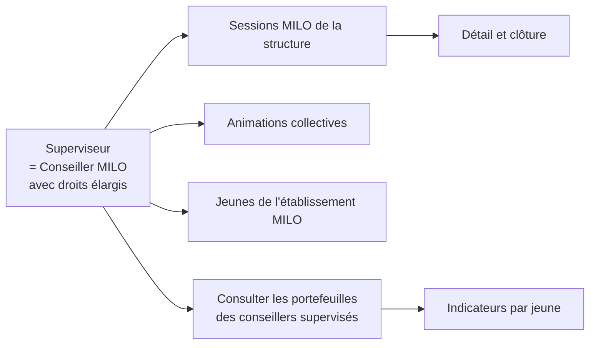
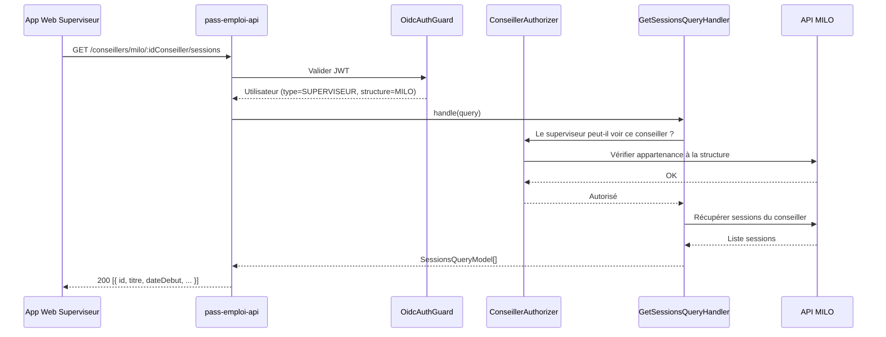
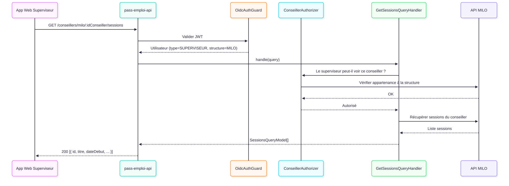

# Superviseur

## Qui est-il ?

Le superviseur est **un conseiller** disposant de droits de supervision sur d'autres conseillers MILO.
Il utilise **l'application web Next.js**, exactement comme un conseiller classique.

Sa particularité : il gère la partie **MILO décorrélée de pass-emploi** — c'est-à-dire les sessions, animations collectives et structures MILO qui existent indépendamment du dispositif pass-emploi. Il n'a pas de portefeuille de jeunes propre mais peut consulter ceux des conseillers qu'il supervise.

> Dans le code, son token JWT contient `type=SUPERVISEUR` (distinct de `CONSEILLER`), ce qui lui ouvre des routes supplémentaires.

---

## Diagramme de capacités

---

## Routes

> Ces routes sont spécifiques au superviseur MILO. Les routes génériques de pass-emploi (jeunes, actions, rendez-vous) sont documentées dans [conseiller.md](./conseiller.md).

### Supervision MILO

| Méthode | Endpoint | Description |
|---|---|---|
| `GET` | `/conseillers/milo/:idConseiller/sessions` | Sessions d'un conseiller supervisé |
| `GET` | `/conseillers/milo/:idConseiller/sessions/:idSession` | Détail d'une session |
| `GET` | `/conseillers/milo/:idConseiller/compteurs-portefeuille` | Compteurs du portefeuille d'un conseiller |
| `GET` | `/conseillers/:idConseiller/jeunes` | Jeunes du portefeuille d'un conseiller supervisé |
| `GET` | `/conseillers/:idConseiller/jeunes/:idJeune/indicateurs` | Indicateurs d'un jeune |
| `GET` | `/structures-milo/:idStructureMilo/jeunes` | Tous les jeunes de la structure MILO |
| `POST` | `/structures-milo/animations-collectives/:idAnimationCollective/cloturer` | Clôturer une animation collective |

---

## Séquence : Consulter les sessions d'un conseiller supervisé

