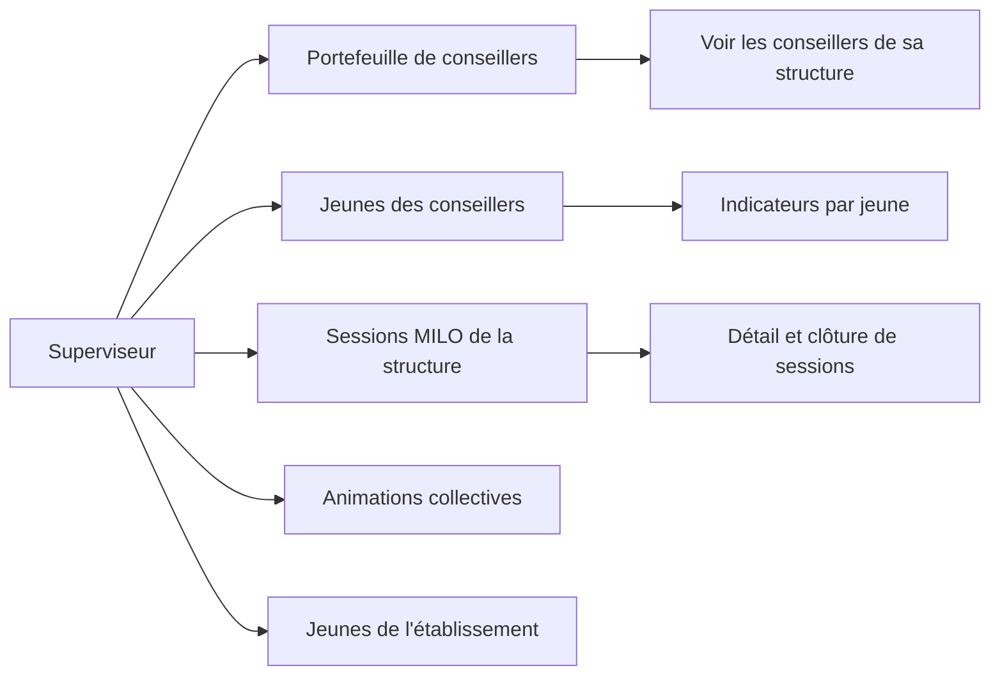
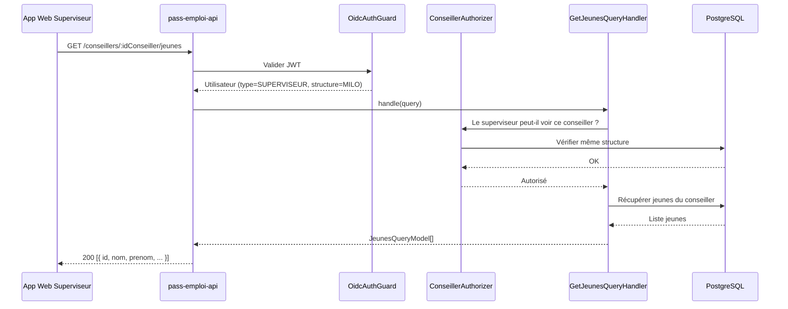

# Superviseur

## Qui est-il ?

Le superviseur supervise plusieurs conseillers au sein d'une même structure. Il utilise **l'application web Next.js**.
Il n'a pas de portefeuille de jeunes propre : il accède aux données de ses conseillers supervisés.

---

## Diagramme de capacités

---

## Routes

### Supervision des conseillers

| Méthode | Endpoint | Description |
|---|---|---|
| `GET` | `/conseillers` | Rechercher des conseillers dans sa structure |
| `GET` | `/conseillers/:idConseiller` | Détail d'un conseiller supervisé |
| `GET` | `/conseillers/:idConseiller/jeunes` | Jeunes du portefeuille d'un conseiller |
| `GET` | `/conseillers/:idConseiller/jeunes/comptage` | Comptage des jeunes d'un conseiller |
| `GET` | `/conseillers/:idConseiller/jeunes/:idJeune/indicateurs` | Indicateurs d'un jeune |

### Sessions MILO (superviseur MILO uniquement)

| Méthode | Endpoint | Description |
|---|---|---|
| `GET` | `/conseillers/milo/:idConseiller/sessions` | Sessions d'un conseiller supervisé |
| `GET` | `/conseillers/milo/:idConseiller/sessions/:idSession` | Détail d'une session |
| `GET` | `/conseillers/milo/:idConseiller/compteurs-portefeuille` | Compteurs du portefeuille d'un conseiller |
| `GET` | `/structures-milo/:idStructureMilo/jeunes` | Tous les jeunes de la structure MILO |
| `POST` | `/structures-milo/animations-collectives/:idAnimationCollective/cloturer` | Clôturer une animation collective |

---

## Séquence : Consulter le portefeuille d'un conseiller

