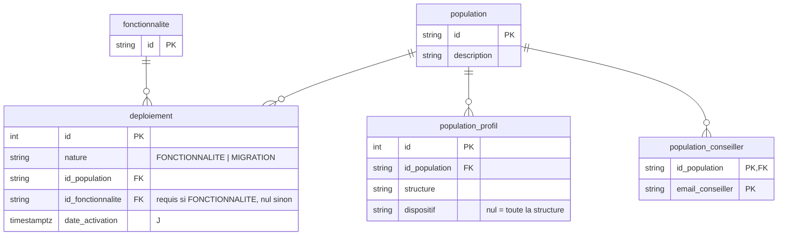

# Déploiements : activer une fonctionnalité ou migrer une population

* Statut : accepté, implémenté (les communications viendront dans une PR suivante)
* Date : 2026-09-14

Trois besoins, un seul squelette : une cible, une date J, un effet à J. Pilote
1J1S par emails, généralisation par structure × dispositif, migration vers une
autre application avec blocage à J. On modélise le squelette une fois, sous le
nom de **déploiement**. Les messages avant J (communications) s'y brancheront
ensuite, sans toucher à ce socle.

## Décisions

1. **Un concept, deux natures.** `deploiement` relie une population, une date
   et une nature. La `nature` vaut `FONCTIONNALITE` ou `MIGRATION` et ne change
   qu'une chose : l'effet à J. C'est la seule énumération du modèle.
2. **Une population nommée, résolue à la lecture.** Des emails de conseillers
   et des couples structure × dispositif. Réutilisable entre déploiements. Pas
   de tag copié sur les utilisateurs : structure et dispositif y sont déjà, une
   copie dériverait.
3. **`fonctionnalite` reste un référentiel de drapeaux.** Jamais de migration
   dedans. Une migration est un déploiement de nature `MIGRATION` sans
   fonctionnalité rattachée.
4. **Les communications viendront après, rattachées à la population.** Une
   campagne par population, à dates absolues, indépendante des déploiements :
   « vous aurez l'app 1J1S » s'écrit une fois, pas une fois par fonctionnalité.
   Voir la section Suite.
5. **Tout part du conseiller**, comme aujourd'hui. Un jeune suit son conseiller
   de référence.

## Modèle



Contraintes en base : un seul déploiement par couple (population,
fonctionnalité), une seule migration par population, `id_fonctionnalite`
obligatoire si et seulement si `nature = FONCTIONNALITE`, un profil unique par
(population, structure, dispositif). Supprimer une population emporte ses
cibles ; une population ou une fonctionnalité visée par un déploiement ne se
supprime pas.

## Règles

**Appartenance.** Un conseiller est dans la population s'il est cité par
email, ou si son profil (structure, dispositif) correspond à un profil de la
population ; un profil sans dispositif couvre toute la structure. Un jeune est
dans la population si son conseiller de référence y est. « De référence » =
`id_conseiller_initial` s'il existe, sinon `id_conseiller`.

> Limite connue : un conseiller MiLo n'a pas de dispositif, donc `(MILO, CEJ)`
> ne cible personne ; viser `(MILO)`. Faire matcher le jeune sur son propre
> profil est possible plus tard, au prix de portefeuilles coupés en deux sur
> une migration.

**Date et activation.** Un déploiement a une seule date J. Il est actif quand
`J <= maintenant`. Le serveur fait autorité sur l'horloge, les dates sortent en
UTC.

**Effet à J.**

| Nature | Ce qui se passe | Code |
|---|---|---|
| `FONCTIONNALITE` | `id_fonctionnalite` apparaît dans `GET /jeunes/:id/fonctionnalites` pour tout jeune de la population. | `FonctionnaliteSqlRepository`, route existante. |
| `MIGRATION` | `PUT /auth/users/:idAuth` répond `422 MIGRATION_PARCOURS_EMPLOI` pour tout jeune et conseiller de la population. `dateDeMigration` = J le plus proche parmi ses migrations, dans `GET /conseillers/:id` et l'accueil FT. | `Migration.Service.faitPartieDeLaMigrationEtLaDateEstPassee`, existant, lit désormais les déploiements. |

## Routes

### Support

Toutes sous `X-API-KEY` support. Un payload invalide répond 400, une règle
métier violée 400, une ressource inconnue 404.

| Route | Corps | Retour |
|---|---|---|
| `POST /support/fonctionnalites` | `{ id }` | 204. Idempotent. |
| `DELETE /support/fonctionnalites/:id` | | 204. 400 si un déploiement la vise. |
| `POST /support/populations` | `{ id, description? }` | 204. Rejouer met à jour la description. |
| `GET /support/populations/:id` | | 200 `{ id, description?, conseillers: [email], profils: [{ structure, dispositif? }], deploiements: [{ id, nature, idFonctionnalite?, dateActivation }] }`. |
| `DELETE /support/populations/:id` | | 204, emporte ses cibles. 400 si un déploiement la vise. |
| `POST /support/populations/conseillers` | `{ id, emailConseillers: string[] }` | 204. Doublons ignorés. |
| `DELETE /support/populations/conseillers` | `{ id, emailConseillers?: string[], supprimerTous?: boolean }` | 204. 400 si ni liste ni `supprimerTous`. |
| `POST /support/populations/profils` | `{ id, structure, dispositif? }` | 204. Doublon ignoré. |
| `DELETE /support/populations/profils` | `{ id, structure, dispositif? }` | 204. |
| `POST /support/deploiements` | `{ nature, idPopulation, idFonctionnalite?, dateActivation }` | 201 `{ id }`. 400 si `FONCTIONNALITE` sans `idFonctionnalite` ou `MIGRATION` avec. Rejouer sur la même population et la même fonctionnalité déplace la date. |
| `DELETE /support/deploiements/:id` | | 204. |
| `POST /support/archiver-jeunes-migration/:idPopulationQuiMigre` | | 204. 404 si aucune migration ne vise la population. |
| `POST /support/rebasculer-jeunes-orphelins-migration/:idPopulationQuiMigre` | | Idem. |
| `POST /support/notifier-beneficiaires` | existant + `idPopulation?` à la place de `idMigration` | 201 `{ jobId }`. |

### Clients

| Route | Retour |
|---|---|
| `GET /jeunes/:id/fonctionnalites` | 200 `{ fonctionnalites: ["PLAN_D_ACTION"] }`. Ids des fonctionnalités dont un déploiement actif vise le jeune. Inchangé. |
| `GET /conseillers/:id` et `GET /jeunes/:id/pole-emploi/accueil` | `dateDeMigration` inchangé, dérivé des déploiements `MIGRATION`. |
| `PUT /auth/users/:idAuth` | 422 `MIGRATION_PARCOURS_EMPLOI` à partir de J d'un déploiement `MIGRATION`. Inchangé. |

## Scénario

### 1. Pilote : `PLAN_D_ACTION` et `QCM` pour vingt conseillers, le 13 octobre

```
POST /support/populations                { "id": "PILOTE_1J1S", "description": "Beta testeurs 1J1S" }
POST /support/populations/conseillers    { "id": "PILOTE_1J1S", "emailConseillers": ["a@ft.fr", "b@milo.fr", …] }
POST /support/deploiements               { "nature": "FONCTIONNALITE", "idPopulation": "PILOTE_1J1S",
                                           "idFonctionnalite": "PLAN_D_ACTION", "dateActivation": "2026-10-13T00:00:00Z" } → 201 { "id": 1 }
POST /support/deploiements               { "nature": "FONCTIONNALITE", "idPopulation": "PILOTE_1J1S",
                                           "idFonctionnalite": "QCM", "dateActivation": "2026-10-13T00:00:00Z" }          → 201 { "id": 2 }
GET  /support/populations/PILOTE_1J1S                                                                                       → 200, tout est là
```

| Date | Ce qui se passe |
|---|---|
| Avant J | `GET /jeunes/:id/fonctionnalites` renvoie `[]` pour ces jeunes. Les messages « j-15 » viendront avec les communications. |
| 13 octobre, J | `GET /jeunes/:id/fonctionnalites` renvoie `["PLAN_D_ACTION", "QCM"]` pour tout jeune dont le conseiller de référence est dans `PILOTE_1J1S`. |

### 2. Une fonctionnalité de plus pour le même pilote

```
POST /support/fonctionnalites            { "id": "AGENDA_PARTAGE" }
POST /support/deploiements               { "nature": "FONCTIONNALITE", "idPopulation": "PILOTE_1J1S",
                                           "idFonctionnalite": "AGENDA_PARTAGE", "dateActivation": "2026-12-07T00:00:00Z" }
```

La population est réutilisée telle quelle. Un conseiller ajouté entre-temps à
`PILOTE_1J1S` est dans tous ses déploiements.

### 3. Généralisation : `PLAN_D_ACTION` pour tous les CEJ France Travail

```
POST /support/populations                { "id": "FT_CEJ" }
POST /support/populations/profils        { "id": "FT_CEJ", "structure": "FRANCE_TRAVAIL", "dispositif": "CEJ" }
POST /support/deploiements               { "nature": "FONCTIONNALITE", "idPopulation": "FT_CEJ",
                                           "idFonctionnalite": "PLAN_D_ACTION", "dateActivation": "2027-01-11T00:00:00Z" }
```

Même drapeau, autre calendrier. Un jeune déjà couvert par le pilote reste
actif, l'union des déploiements fait foi.

### 4. Migration : une vague vers l'autre application, le 1er mars

```
POST /support/populations                { "id": "PHASE_C", "description": "Migration conseillers AIJ" }
POST /support/populations/conseillers    { "id": "PHASE_C", "emailConseillers": [ … ] }
POST /support/populations/profils        { "id": "PHASE_C", "structure": "FRANCE_TRAVAIL", "dispositif": "AIJ" }
POST /support/deploiements               { "nature": "MIGRATION", "idPopulation": "PHASE_C", "dateActivation": "2027-03-01T00:00:00Z" }
```

| Date | Ce qui se passe |
|---|---|
| Dès la création | `GET /conseillers/:id` et l'accueil FT renvoient `dateDeMigration: 2027-03-01` pour les utilisateurs de `PHASE_C`. Comportement existant. |
| 1er mars, J | `PUT /auth/users/:idAuth` répond 422 `MIGRATION_PARCOURS_EMPLOI` pour ces jeunes et conseillers. |
| Après J | `POST /support/rebasculer-jeunes-orphelins-migration/PHASE_C` puis `POST /support/archiver-jeunes-migration/PHASE_C`, routes existantes. |

## Reprise des données

Migration `20260914000000-populations-deploiements`, testée en `up`, `down`,
`up`. Elle part de `feature_flip` (colonnes `feature_tag`, `email_conseiller`).

* Tag `MIGRATION_X` (`MIGRATION_PHASE_A`, `MIGRATION_PHASE_B`…) : une
  population `X` avec ses emails et un déploiement `MIGRATION`. Les URLs
  support `…/:idMigration` deviennent `…/:idPopulation` avec les mêmes valeurs.
* Tout autre tag : une fonctionnalité et une population de même id avec ses
  emails et un déploiement `FONCTIONNALITE`.
* **Tous les déploiements repris sont actifs immédiatement** : J = date de la
  migration, aucune variable d'environnement lue. Le comportement des
  utilisateurs ne change pas : les bêta-testeurs gardent leurs drapeaux, les
  vagues de migration restent bloquées, la vue analytics démarches IA suit le
  déploiement `DEMARCHES_IA`. Les variables `DATE_MIGRATION_PHASE_A` et `_B`
  disparaissent ; `dateDeMigration` renvoie désormais la date de la migration.
* `population_profil` reste vide : rien ne ciblait par profil avant.
* `feature_flip` : supprimée. Le `down` la reconstruit à partir des
  déploiements et des emails des populations.

## Livraison

Livré d'un bloc : populations, déploiements, effets à J, reprise, routes
support, filtre `idPopulation` sur `POST /support/notifier-beneficiaires`. Le
contrat de `GET /jeunes/:id/fonctionnalites` est identique, rien à faire côté
app et web.

## Suite : communications

Hors de cette PR. Cible retenue :

```
communication { id PK, id_population FK, destinataire JEUNE | CONSEILLER, type IN_APP | NOTIFICATION,
                date_debut, date_fin, titre, contenu, cta_label, cta_url_android, cta_url_ios }
```

* Rattachée à la population, pas au déploiement : une campagne par population.
* `IN_APP` : visible de `date_debut` à `date_fin`, calculée à la lecture, via
  `GET /jeunes/:id/communications` et `GET /conseillers/:id/communications`.
* `NOTIFICATION` : un cron quotidien enfile `NOTIFIER_BENEFICIAIRES` avec
  `idPopulation`, déjà supporté par le job. Prévoir une trace d'envoi
  (`envoyee_le`) pour ne pas renvoyer, et le `typeNotification` qui pilote la
  page ouverte au clic.
* Un lien web pour le conseiller (`cta_url_web`) si le web affiche les
  communications.

## Points ouverts

1. **Textes des bannières de migration** : en base via `communication`, ou
   laissés dans l'app et le web. Les deux marchent.
2. **Cibler un jeune par id** pour la recette. Troisième sorte de cible,
   facile, hors première étape.
3. **Match du jeune sur son propre profil**, pour viser `(MILO, CEJ)`. À
   ouvrir seulement si le besoin se confirme, voir la limite en section
   Règles.

## Liens

* `src/domain/population.ts`, `src/domain/deploiement.ts`,
  `src/domain/fonctionnalite.ts`, `src/domain/migration.ts`,
  `src/infrastructure/repositories/population.repository.db.ts` (appartenance),
  `src/application/commands/update-utilisateur.command.handler.ts`
  (`lUtilisateurDoitMigrerVersParcoursEmploi`),
  `src/application/jobs/notifier-beneficiaires.job.handler.db.ts`.
