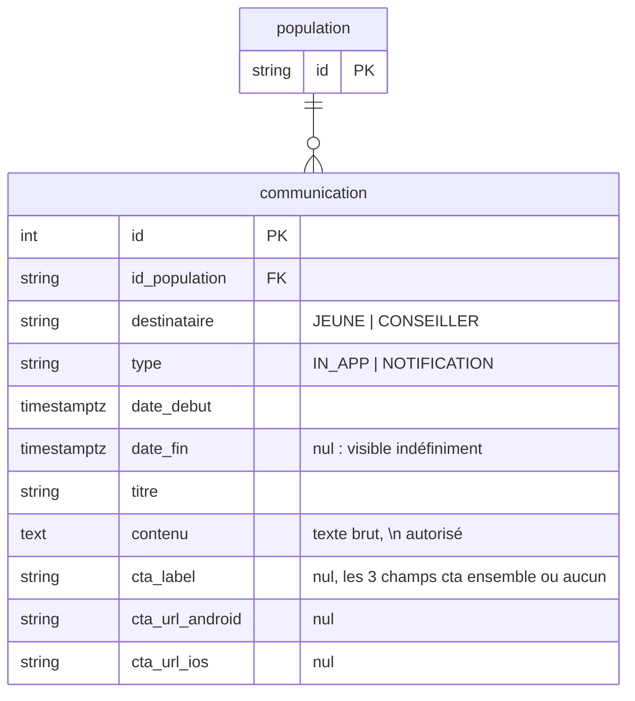

# Communications : un message porté par le back, ciblé par population

* Statut : accepté, implémenté pour les bandeaux `IN_APP` (conseillers puis jeunes) ; envoi `NOTIFICATION` à venir
* Date : 2026-09-16, complété le 2026-09-21
* Suite de [ADR-006](ADR-006-deploiements-fonctionnalites-migrations.md), section « Suite : communications »

Avant J d'un déploiement, on veut prévenir les utilisateurs : « le 15 octobre,
votre application évolue ». Aujourd'hui le back n'envoie qu'une date
(`dateDeMigration`) et le texte du bandeau est écrit en dur dans le web et
l'app. Chaque changement de formulation est une livraison front, et le texte ne
peut pas différer d'une population à l'autre. On déplace le message en base :
le back envoie titre et contenu, le front affiche.

## Décisions

1. **Une communication est rattachée à une population, pas à un déploiement.**
   Une campagne s'écrit une fois par population, quels que soient les
   déploiements qui la visent. L'appartenance à la population se lit avec les
   mêmes règles que pour les déploiements (`sqlConseillerDansPopulation`,
   `sqlJeuneDansPopulation`, ADR-006 § Règles).
2. **Deux énumérations et rien d'autre.** `destinataire` (`JEUNE` |
   `CONSEILLER`) dit à qui, `type` (`IN_APP` | `NOTIFICATION`) dit comment. Le
   reste est du contenu.
3. **Visible à partir d'une date, calculé à la lecture.** `date_debut <=
   maintenant`, serveur faisant autorité sur l'horloge, comme les
   déploiements. Pas d'état « active » stocké. `date_fin` (exclue) borne la
   fin de visibilité, mais son caractère obligatoire dépend du `type` — voir
   décision 10.
4. **Un seul message par lecture : le plus urgent.** Un utilisateur peut être
   dans plusieurs populations (l'union fait foi, ADR-006 scénario 3). Le front
   n'affiche qu'un bandeau, on renvoie la communication dont `date_fin` est la
   plus proche — l'équivalent du `MIN(date_activation)` de `dateDeMigration`.
   Une communication sans `date_fin` (visible indéfiniment) passe toujours
   après celles qui en ont une : elle n'est jamais urgente par définition
   (`ORDER BY date_fin ASC NULLS LAST`, comportement par défaut de Postgres,
   rendu explicite dans la requête).
5. **Le contenu est du texte brut.** Les sauts de ligne (`\n`) sont respectés
   par le front, rien d'autre n'est interprété. Pas de HTML : pas de
   sanitisation à faire, et le même texte sert au web et au mobile.
6. **L'id est technique.** `SERIAL`, renvoyé à la création comme pour les
   déploiements. Deux utilisateurs d'une même population reçoivent le même id ;
   le mobile s'en sert pour son état local, le web l'ignore.
7. **Supprimer une population emporte ses communications.** Contrairement à un
   déploiement, une communication n'a pas d'effet au-delà de sa population :
   la garder orpheline n'aurait pas de sens. FK en `ON DELETE CASCADE`, comme
   les cibles (emails, profils).
8. **Les handlers support écrivent en Sequelize direct**, le repository domaine
   ne sert qu'à la lecture côté client : [ADR-008](ADR-008-handlers-support-sql-direct.md).
9. **Le CTA se renseigne en entier ou pas du tout.** `ctaLabel`, `ctaUrlAndroid`
   et `ctaUrlIos` sont optionnels ensemble, jamais séparément : un lien de
   téléchargement sans les deux stores n'a pas de sens pour le mobile. Vérifié
   à la création (`Communication.creer`), donc aussi bien pour `POST` que pour
   `PUT` (même fonction).
10. **`date_fin` est optionnelle pour `IN_APP`.** Absente, le bandeau est
    visible indéfiniment jusqu'à suppression manuelle (utile pour un message
    permanent, pas lié à une échéance connue à l'avance).
11. **`NOTIFICATION` est refusée tant que l'envoi n'est pas livré.**
    `Communication.creer` renvoie 400 pour ce `type`. Accepter des
    communications « en réserve » laisserait en base des lignes qui partiraient
    toutes, sans validation, au premier passage du futur cron d'envoi. Les
    règles propres à `NOTIFICATION` (pas de `date_fin`, `destinataire` `JEUNE`,
    `push`, `typeNotification`, limites de longueur) arrivent avec l'envoi —
    voir Livraison.

## Modèle



Contraintes en base : `date_debut < date_fin` (satisfaite d'office par
Postgres quand `date_fin` est `NULL`, donc pas de migration à part pour la
rendre optionnelle au-delà d'un `DROP NOT NULL`), FK `id_population` en
`ON DELETE CASCADE`. Pas d'unicité : deux campagnes sur une même population
sont légitimes (l'une après l'autre, ou l'une pour les jeunes et l'autre pour
les conseillers). Les règles sur le CTA (tout-ou-rien) et sur le `type` sont
vérifiées dans `Communication.creer`, pas en `CHECK` SQL : elles sont
partagées par `POST` et `PUT`, donc plus simples à faire évoluer côté domaine
qu'en migration.

## Routes

### Support

Sous `X-API-KEY` support, dans le même groupe Swagger que les populations.

| Route | Corps | Retour |
|---|---|---|
| `POST /support/communications` | `{ idPopulation, destinataire, type, dateDebut, dateFin?, titre, contenu, ctaLabel?, ctaUrlAndroid?, ctaUrlIos? }` | 201 `{ id }`. 404 population inconnue, 400 si `dateDebut >= dateFin` (quand fournie), date invalide, CTA partiel, ou `type` `NOTIFICATION` (décision 11). Pas d'upsert. |
| `PUT /support/communications/:id` | mêmes champs que la création | 204. Remplace tout le contenu (un champ absent, un CTA ou `dateFin` compris, est effacé). 404 communication ou population inconnue, 400 dates/CTA/`NOTIFICATION`. |
| `DELETE /support/communications/:id` | | 204. 404 sinon. |
| `GET /support/populations/:id` | | ajoute `communications: [{ id, destinataire, type, dateDebut, dateFin?, titre, contenu, ctaLabel?, ctaUrlAndroid?, ctaUrlIos? }]`. |
| `DELETE /support/populations/:id` | | supprime aussi ses communications (toujours 400 si un déploiement la vise). |

### Clients

| Route | Retour |
|---|---|
| `GET /conseillers/:id/communications` | 200 `{ messageInformatif?: { id, titre, contenu } }`. La communication `CONSEILLER` × `IN_APP` visible maintenant dont `date_fin` est la plus proche ; `messageInformatif` absent s'il n'y en a pas. Autorisation : le conseiller lui-même, `DISPOSITIFS_ACCOMPAGNES`. |
| `GET /jeunes/:id/communications` | 200 `{ messageInformatif?: { id, titre, contenu, cta?: { label, urlAndroid, urlIos } } }`. Même lecture côté jeune (`JEUNE` × `IN_APP`, `sqlJeuneDansPopulation`) ; `cta` absent si la communication n'en a pas. Autorisation : le jeune lui-même, tous profils sauf invité. |
| `GET /conseillers/:id` | `dateDeMigration` inchangé (l'app mobile et l'accueil FT s'en servent encore). Le web ne le lit plus. |

## Scénario

```
POST /support/populations         { "id": "PHASE_C" }
POST /support/populations/profils { "id": "PHASE_C", "structure": "FRANCE_TRAVAIL", "dispositif": "AIJ" }
POST /support/deploiements        { "nature": "MIGRATION", "idPopulation": "PHASE_C", "dateActivation": "2026-10-15T00:00:00Z" }
POST /support/communications      { "idPopulation": "PHASE_C", "destinataire": "CONSEILLER", "type": "IN_APP",
                                    "dateDebut": "2026-09-30T00:00:00Z", "dateFin": "2026-10-15T00:00:00Z",
                                    "titre": "Votre application évolue",
                                    "contenu": "Le 15 octobre 2026, l’application pass emploi ne sera plus disponible. Vos services seront accessibles sur l’application Parcours Emploi.\nNous vous recommandons de ne plus ajouter de nouveaux bénéficiaires à votre portefeuille." }
                                                                                                    → 201 { "id": 3 }
```

| Date | `GET /conseillers/:id/communications` pour un conseiller FT AIJ |
|---|---|
| Avant le 30 septembre | `{}` |
| Du 30 septembre au 14 octobre | `{ "messageInformatif": { "id": 3, "titre": "Votre application évolue", "contenu": "…" } }` |
| À partir du 15 octobre | `{}` — et la connexion est refusée par le déploiement `MIGRATION`. |

Autre cas : un bandeau permanent, sans échéance connue, qu'on retirera à la
main quand il ne sera plus pertinent — `dateFin` simplement omise :

```
POST /support/communications      { "idPopulation": "PILOTE_1J1S", "destinataire": "CONSEILLER", "type": "IN_APP",
                                    "dateDebut": "2026-09-01T00:00:00Z",
                                    "titre": "Vous testez la nouvelle fonctionnalité 1J1S",
                                    "contenu": "Un retour ? Écrivez-nous à support@pass-emploi.fr" }
                                                                                                    → 201 { "id": 5 }
```

Visible dès le 1ᵉʳ septembre, sans jamais disparaître d'elle-même.

## Livraison

**Première étape** (PR `feat/communications`) : table complète, routes
support, route conseiller, bandeau web. Le web abandonne `dateDeMigration` et
affiche `titre` / `contenu` tels quels.

**Deuxième étape** (PR `feat/communications-beneficiaires`) : côté jeune,
bandeau uniquement. `GET /jeunes/:id/communications` avec CTA ; règle CTA
tout-ou-rien et `date_fin` optionnelle dans `Communication.creer` ;
`NOTIFICATION` refusée. Côté mobile : consommer la route et afficher le
bandeau + CTA — `id` est un **nombre** dans le JSON.

**Troisième étape** (PR `feat/communications-notifications`) : envoi des
`NOTIFICATION` par lots courts pilotés par l'état en base (`statut_envoi`,
table `communication_envoi`), kill switch et relance support, remplacement de
`NOTIFIER_BENEFICIAIRES`. Design :
`docs/superpowers/specs/2026-09-17-envoi-communications-design.md`.

Hors de cette ADR :

* `cta_url_web` si le web doit un jour afficher un lien.
* Une route support de prévisualisation d'une population (stats + liste
  conseillers/jeunes avant un envoi) : sujet transverse au ciblage par
  population, suivi à part.

## Liens

* [ADR-006](ADR-006-deploiements-fonctionnalites-migrations.md) : populations
  et déploiements, règles d'appartenance.
* `src/domain/communication.ts`,
  `src/infrastructure/repositories/communication.repository.db.ts`,
  `src/infrastructure/repositories/sql-helpers.ts` (appartenance).
