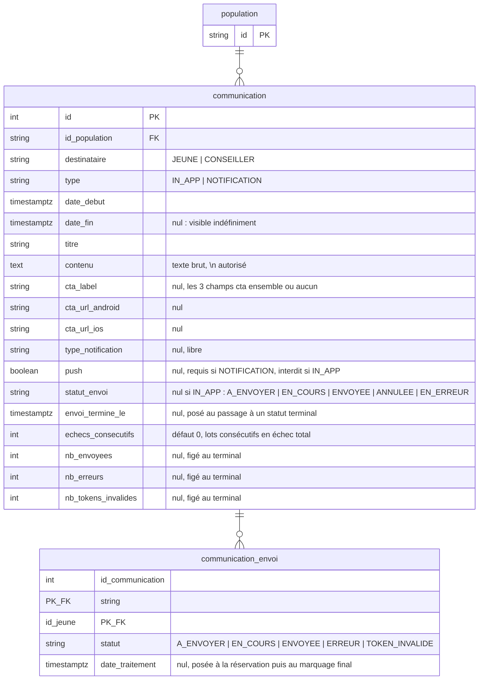

# Communications : un message porté par le back, ciblé par population

* Statut : accepté, implémenté (conseillers, jeunes, envoi push)
* Date : 2026-09-16, complété le 2026-09-22
* Suite de [ADR-006](ADR-006-deploiements-fonctionnalites-migrations.md), section « Suite : communications »

Avant J d'un déploiement, on veut prévenir les utilisateurs : « le 15 octobre,
votre application évolue ». Aujourd'hui le back n'envoie qu'une date
(`dateDeMigration`) et le texte du bandeau est écrit en dur dans le web et
l'app. Chaque changement de formulation est une livraison front, et le texte ne
peut pas différer d'une population à l'autre. On déplace le message en base :
le back envoie titre et contenu, le front affiche.

## Décisions

1. **Une communication est rattachée à une population, pas à un déploiement.**
   Une campagne s'écrit une fois par population, quels que soient les
   déploiements qui la visent. L'appartenance à la population se lit avec les
   mêmes règles que pour les déploiements (`sqlConseillerDansPopulation`,
   `sqlJeuneDansPopulation`, ADR-006 § Règles).
2. **Deux énumérations et rien d'autre.** `destinataire` (`JEUNE` |
   `CONSEILLER`) dit à qui, `type` (`IN_APP` | `NOTIFICATION`) dit comment. Le
   reste est du contenu.
3. **Visible à partir d'une date, calculé à la lecture.** `date_debut <=
   maintenant`, serveur faisant autorité sur l'horloge, comme les
   déploiements. Pas d'état « active » stocké. `date_fin` (exclue) borne la
   fin de visibilité, mais son caractère obligatoire dépend du `type` — voir
   décision 10.
4. **Un seul message par lecture : le plus urgent.** Un utilisateur peut être
   dans plusieurs populations (l'union fait foi, ADR-006 scénario 3). Le front
   n'affiche qu'un bandeau, on renvoie la communication dont `date_fin` est la
   plus proche — l'équivalent du `MIN(date_activation)` de `dateDeMigration`.
   Une communication sans `date_fin` (visible indéfiniment) passe toujours
   après celles qui en ont une : elle n'est jamais urgente par définition
   (`ORDER BY date_fin ASC NULLS LAST`, comportement par défaut de Postgres,
   rendu explicite dans la requête).
5. **Le contenu est du texte brut.** Les sauts de ligne (`\n`) sont respectés
   par le front, rien d'autre n'est interprété. Pas de HTML : pas de
   sanitisation à faire, et le même texte sert au web et au mobile.
6. **L'id est technique.** `SERIAL`, renvoyé à la création comme pour les
   déploiements. Deux utilisateurs d'une même population reçoivent le même id ;
   le mobile s'en sert pour son état local, le web l'ignore.
7. **Supprimer une population emporte ses communications.** Contrairement à un
   déploiement, une communication n'a pas d'effet au-delà de sa population :
   la garder orpheline n'aurait pas de sens. FK en `ON DELETE CASCADE`, comme
   les cibles (emails, profils).
8. **Les handlers support écrivent en Sequelize direct**, le repository domaine
   ne sert qu'à la lecture côté client : [ADR-008](ADR-008-handlers-support-sql-direct.md).
9. **Le CTA se renseigne en entier ou pas du tout.** `ctaLabel`, `ctaUrlAndroid`
   et `ctaUrlIos` sont optionnels ensemble, jamais séparément : un lien de
   téléchargement sans les deux stores n'a pas de sens pour le mobile. Vérifié
   à la création (`Communication.creer`), donc aussi bien pour `POST` que pour
   `PUT` (même fonction).
10. **`date_fin` est optionnelle pour `IN_APP`.** Absente, le bandeau est
    visible indéfiniment jusqu'à suppression manuelle (utile pour un message
    permanent, pas lié à une échéance connue à l'avance).
11. **`NOTIFICATION` est envoyée par lots par un cron à la minute, pilotée par
    `statut_envoi`.** `A_ENVOYER` → `EN_COURS` → `ENVOYEE` | `ANNULEE` |
    `EN_ERREUR` (les trois derniers terminaux). Une seule communication
    `EN_COURS` à la fois ; le cron `ENVOYER_COMMUNICATIONS` (`* 8-16 * * 1-5`)
    fige la population au démarrage (table `communication_envoi`) puis envoie
    des lots fixes de 300 jeunes par minute, sans plafond global : une grosse
    population déborde sur les jours ouvrés suivants plutôt que d'être
    bridée. Un lot 100 % en échec (Firebase indisponible) est rendu tel quel
    (rien n'est perdu) et incrémente `echecs_consecutifs` ; à 3 lots
    consécutifs en échec total, la communication bascule `EN_ERREUR`. Les
    lignes `EN_COURS` non traitées après 30 minutes sont libérées (worker
    mort en plein lot). `PUT` et `DELETE /support/communications/:id` sont
    refusés (400) dès que `statut_envoi` a quitté `A_ENVOYER` : on ne réécrit
    ni n'efface un message à moitié ou totalement parti. **Pas de relance** :
    `ANNULEE` et `EN_ERREUR` sont terminaux, sans retour possible à
    `A_ENVOYER` ; reprendre veut dire créer une nouvelle communication, qui
    repart sur toute la population, y compris les jeunes déjà servis —
    trade-off assumé, `EN_ERREUR` exigeant déjà 3 minutes consécutives
    d'échec total et l'annulation étant un choix explicite du support.
    Détail dans `docs/superpowers/specs/2026-09-17-envoi-communications-design.md`.
12. **`typeNotification` est optionnel, `push` est obligatoire pour
    `NOTIFICATION`.** `push` (booléen) décide si l'envoi pousse une alerte
    (Firebase) ou se contente d'alimenter silencieusement le centre de
    notifications du jeune ; sans lui, `Communication.creer` refuse la
    création (comme pour `IN_APP`, où `push` est à l'inverse interdit).
    `typeNotification` pilote le deeplink au clic côté mobile mais n'a pas de
    valeur par défaut côté API : absent, l'app le traite comme
    `CENTRE_DE_NOTIFS_UNIQUEMENT` et ne redirige nulle part.

## Modèle



Contraintes en base : `date_debut < date_fin` (satisfaite d'office par
Postgres quand `date_fin` est `NULL`, donc pas de migration à part pour la
rendre optionnelle au-delà d'un `DROP NOT NULL`), FK `id_population` en
`ON DELETE CASCADE`. Pas d'unicité : deux campagnes sur une même population
sont légitimes (l'une après l'autre, ou l'une pour les jeunes et l'autre pour
les conseillers). Les règles sur le CTA (tout-ou-rien), sur `push` et sur le
`type` sont vérifiées dans `Communication.creer`, pas en `CHECK` SQL : elles
sont partagées par `POST` et `PUT`, donc plus simples à faire évoluer côté
domaine qu'en migration.

`communication_envoi` est la file de travail de l'envoi : une ligne par
jeune de la population *figée* au démarrage (`push = true` ne retient que
les jeunes avec `push_notification_token`), PK `(id_communication,
id_jeune)`, `id_communication` et `id_jeune` en `ON DELETE CASCADE`, index
`(id_communication, statut)`. Elle ne duplique pas `notification_jeune` (le
centre de notifications affiché au jeune, purgé à 10 jours, sans statut
d'envoi) : le lot appelle le `send()` existant, qui continue d'alimenter
`notification_jeune` comme aujourd'hui.

## Routes

### Support

Sous `X-API-KEY` support, dans le même groupe Swagger que les populations.

| Route | Corps | Retour |
|---|---|---|
| `POST /support/communications` | `{ idPopulation, destinataire, type, dateDebut, dateFin?, titre, contenu, ctaLabel?, ctaUrlAndroid?, ctaUrlIos?, typeNotification?, push? }` | 201 `{ id }`. 404 population inconnue, 400 si `dateDebut >= dateFin` (quand fournie), date invalide, CTA partiel, ou règles `NOTIFICATION` (décisions 11-12, `push` compris) non respectées. Pas d'upsert. |
| `PUT /support/communications/:id` | mêmes champs que la création | 204. Remplace tout le contenu (un champ absent, un CTA, `dateFin` ou `push` compris, est effacé). 404 communication ou population inconnue, 400 dates/CTA/`NOTIFICATION`, **ou 400 dès que `statut_envoi` a quitté `A_ENVOYER`** (décision 11). |
| `DELETE /support/communications/:id` | | 204. 404 sinon, **ou 400 dès que `statut_envoi` a quitté `A_ENVOYER`** (décision 11). |
| `POST /support/communications/:id/envoi/annulation` | | 204. `EN_COURS` → `ANNULEE`, `envoi_termine_le` et totaux figés ; le tick suivant du cron ne fait plus rien (un lot déjà en vol va au bout de ses ≤ 300 envois). 400 pour tout autre `statut_envoi`. |
| `GET /support/populations/:id` | | ajoute `communications: [{ id, destinataire, type, dateDebut, dateFin?, titre, contenu, ctaLabel?, ctaUrlAndroid?, ctaUrlIos?, typeNotification?, push?, statutEnvoi?, envoiTermineLe?, nbDestinataires?, envoi? }]`. `NOTIFICATION` seulement pour les six derniers champs : `nbDestinataires` tant que `A_ENVOYER` (effectif live qui partirait si l'envoi démarrait maintenant — le garde-fou support avant `dateDebut`) ; `envoi` (`envoyees`, `erreurs`, `tokensInvalides`, + `aEnvoyer`/`enCours` en direct si `EN_COURS`) une fois l'envoi démarré, en compteurs vivants puis figés au terminal. |
| `DELETE /support/populations/:id` | | supprime aussi ses communications (toujours 400 si un déploiement la vise). |

### Clients

| Route | Retour |
|---|---|
| `GET /conseillers/:id/communications` | 200 `{ messageInformatif?: { id, titre, contenu } }`. La communication `CONSEILLER` × `IN_APP` visible maintenant dont `date_fin` est la plus proche ; `messageInformatif` absent s'il n'y en a pas. Autorisation : le conseiller lui-même, `DISPOSITIFS_ACCOMPAGNES`. |
| `GET /jeunes/:id/communications` | 200 `{ messageInformatif?: { id, titre, contenu, cta?: { label, urlAndroid, urlIos } } }`. Même lecture côté jeune (`JEUNE` × `IN_APP`, `sqlJeuneDansPopulation`) ; `cta` absent si la communication n'en a pas. Autorisation : le jeune lui-même, tous profils sauf invité. |
| `GET /conseillers/:id` | `dateDeMigration` inchangé (l'app mobile et l'accueil FT s'en servent encore). Le web ne le lit plus. |

## Scénario

```
POST /support/populations         { "id": "PHASE_C" }
POST /support/populations/profils { "id": "PHASE_C", "structure": "FRANCE_TRAVAIL", "dispositif": "AIJ" }
POST /support/deploiements        { "nature": "MIGRATION", "idPopulation": "PHASE_C", "dateActivation": "2026-10-15T00:00:00Z" }
POST /support/communications      { "idPopulation": "PHASE_C", "destinataire": "CONSEILLER", "type": "IN_APP",
                                    "dateDebut": "2026-09-30T00:00:00Z", "dateFin": "2026-10-15T00:00:00Z",
                                    "titre": "Votre application évolue",
                                    "contenu": "Le 15 octobre 2026, l’application pass emploi ne sera plus disponible. Vos services seront accessibles sur l’application Parcours Emploi.\nNous vous recommandons de ne plus ajouter de nouveaux bénéficiaires à votre portefeuille." }
                                                                                                    → 201 { "id": 3 }
```

| Date | `GET /conseillers/:id/communications` pour un conseiller FT AIJ |
|---|---|
| Avant le 30 septembre | `{}` |
| Du 30 septembre au 14 octobre | `{ "messageInformatif": { "id": 3, "titre": "Votre application évolue", "contenu": "…" } }` |
| À partir du 15 octobre | `{}` — et la connexion est refusée par le déploiement `MIGRATION`. |

Même population, communication `NOTIFICATION` cette fois (une notification
push, en plus du bandeau `IN_APP` ci-dessus) :

```
POST /support/communications      { "idPopulation": "PHASE_C", "destinataire": "JEUNE", "type": "NOTIFICATION",
                                    "push": true, "typeNotification": "MIGRATION_PARCOURS_EMPLOI",
                                    "dateDebut": "2026-09-30T00:00:00Z",
                                    "titre": "Votre appli évolue", "contenu": "Téléchargez Parcours Emploi" }
                                                                                                    → 201 { "id": 4 }
```

→ `A_ENVOYER`. `GET /support/populations/PHASE_C` renvoie `nbDestinataires: 3200`
(ordre de grandeur attendu, à relire avant `dateDebut`).

Mardi 30/09 : 8h00 tick → réclame, fige 3 200 lignes dans `communication_envoi`,
`EN_COURS`. 8h01 → lot de 300 (298 `ENVOYEE`, 1 `TOKEN_INVALIDE`, 1 `ERREUR`).
8h02 → 300. … 8h11 → 200. 8h12 → plus rien à réserver → `ENVOYEE`,
`nb_envoyees = 3150`, `nb_erreurs = 12`, `nb_tokens_invalides = 38`. 8h13 → rien
à faire.

Variante crash : 8h05, le worker est tué au 143ᵉ jeune du lot en cours. 142
`ENVOYEE`, 158 restent `EN_COURS`. De 8h06 à 8h34, les ticks suivants réservent
d'autres lignes et ignorent les 158 (< 30 minutes). À 8h35, elles sont libérées
puis renvoyées. Seul le 143ᵉ, parti juste avant le crash, reçoit la
notification deux fois.

Autre cas : un bandeau permanent, sans échéance connue, qu'on retirera à la
main quand il ne sera plus pertinent — `dateFin` simplement omise :

```
POST /support/communications      { "idPopulation": "PILOTE_1J1S", "destinataire": "CONSEILLER", "type": "IN_APP",
                                    "dateDebut": "2026-09-01T00:00:00Z",
                                    "titre": "Vous testez la nouvelle fonctionnalité 1J1S",
                                    "contenu": "Un retour ? Écrivez-nous à support@pass-emploi.fr" }
                                                                                                    → 201 { "id": 5 }
```

Visible dès le 1ᵉʳ septembre, sans jamais disparaître d'elle-même.

## Livraison

**Première étape** (PR `feat/communications`) : table complète, routes
support, route conseiller, bandeau web. Le web abandonne `dateDeMigration` et
affiche `titre` / `contenu` tels quels.

**Deuxième étape** (PR `feat/communications-beneficiaires`) : côté jeune,
bandeau uniquement. `GET /jeunes/:id/communications` avec CTA ; règle CTA
tout-ou-rien et `date_fin` optionnelle dans `Communication.creer` ;
`NOTIFICATION` refusée. Côté mobile : consommer la route et afficher le
bandeau + CTA — `id` est un **nombre** dans le JSON.

**Troisième étape** (PR `feat/communications-notifications`) : **livrée**.
Envoi des `NOTIFICATION` par lots pilotés par l'état en base (`statut_envoi`,
table `communication_envoi`, cron unique `ENVOYER_COMMUNICATIONS`), kill
switch config, annulation support, remplacement du job
`NOTIFIER_BENEFICIAIRES` et de la route `POST /support/notifier-beneficiaires`.
Design détaillé (déroulé du cron, lots, garde-fous de mise en production) :
`docs/superpowers/specs/2026-09-17-envoi-communications-design.md`.

Procédure post-déploiement, à faire une fois avant la première `NOTIFICATION`
réelle :

1. `yarn tasks:initialiser-les-crons` (procédure habituelle post-deploy) —
   sans ça, le cron `ENVOYER_COMMUNICATIONS` n'existe pas.
2. Avant la migration qui ajoute `statut_envoi`, vérifier
   `SELECT count(*) FROM communication WHERE type = 'NOTIFICATION'` : les
   lignes déjà en base basculent en `ANNULEE` (jamais `A_ENVOYER`), il ne
   devrait y en avoir aucune en production (la branche bandeau les refusait
   en 400 à la création).
3. Première campagne réelle sur une population de test (comptes de l'équipe),
   pas directement sur une population large — voir
   `docs/TROUBLESHOOT.md`.

Hors de cette ADR :

* `cta_url_web` si le web doit un jour afficher un lien.
* Relance d'une communication `ANNULEE` ou `EN_ERREUR` (décision 11) : la
  seule voie actuelle est d'en recréer une, sur toute la population.
* Envoi Firebase multicast (`sendEach`) : évolution possible d'un lot, pas
  nécessaire au volume actuel.
* Une route support de prévisualisation complète d'une population (liste des
  conseillers/jeunes, pas seulement leur effectif) : sujet transverse au
  ciblage par population, suivi à part. `nbDestinataires` en est la version
  minimale, livrée avec cette étape.

## Points ouverts

* **Push sans deeplink côté mobile.** `typeNotification` absent (ou
  `CENTRE_DE_NOTIFS_UNIQUEMENT`) pousse une alerte que l'app ne sait pas
  rediriger au clic : elle ouvre simplement le centre de notifications. Pas
  bloquant (comportement par défaut cohérent), mais à valider avec le mobile
  si un jour une notification `NOTIFICATION` veut un deeplink dédié.
* **`TOKEN_INVALIDE` ne nettoie pas `jeune.push_notification_token`.** Le
  jeune reste réenrôlé dans une prochaine campagne avec le même token mort,
  jusqu'à un futur appel de l'app qui le rafraîchit. À vérifier si d'autres
  jobs d'envoi le nullent déjà, et si ce comportement doit être aligné.

## Liens

* [ADR-006](ADR-006-deploiements-fonctionnalites-migrations.md) : populations
  et déploiements, règles d'appartenance.
* `src/domain/communication.ts`,
  `src/infrastructure/repositories/communication.repository.db.ts`,
  `src/infrastructure/repositories/sql-helpers.ts` (appartenance).
* `src/application/jobs/envoyer-communications.job.handler.db.ts` (cron,
  lots), `src/config/configuration.ts` (`jobs.envoiCommunications`, kill
  switch et taille de lot).
* Design détaillé de l'envoi :
  `docs/superpowers/specs/2026-09-17-envoi-communications-design.md`.
