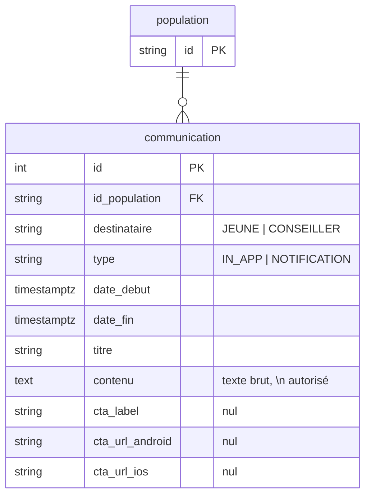

# Communications : un message porté par le back, ciblé par population

* Statut : accepté, en cours d'implémentation (première étape : message informatif des conseillers)
* Date : 2026-09-16
* Suite de [ADR-006](ADR-006-deploiements-fonctionnalites-migrations.md), section « Suite : communications »

Avant J d'un déploiement, on veut prévenir les utilisateurs : « le 15 octobre,
votre application évolue ». Aujourd'hui le back n'envoie qu'une date
(`dateDeMigration`) et le texte du bandeau est écrit en dur dans le web et
l'app. Chaque changement de formulation est une livraison front, et le texte ne
peut pas différer d'une population à l'autre. On déplace le message en base :
le back envoie titre et contenu, le front affiche.

## Décisions

1. **Une communication est rattachée à une population, pas à un déploiement.**
   Une campagne s'écrit une fois par population, quels que soient les
   déploiements qui la visent. L'appartenance à la population se lit avec les
   mêmes règles que pour les déploiements (`sqlConseillerDansPopulation`,
   `sqlJeuneDansPopulation`, ADR-006 § Règles).
2. **Deux énumérations et rien d'autre.** `destinataire` (`JEUNE` |
   `CONSEILLER`) dit à qui, `type` (`IN_APP` | `NOTIFICATION`) dit comment. Le
   reste est du contenu.
3. **Visible entre deux dates absolues, calculé à la lecture.** `date_debut <=
   maintenant < date_fin`, serveur faisant autorité sur l'horloge, comme les
   déploiements. Pas d'état « active » stocké.
4. **Un seul message par lecture : le plus urgent.** Un utilisateur peut être
   dans plusieurs populations (l'union fait foi, ADR-006 scénario 3). Le front
   n'affiche qu'un bandeau, on renvoie la communication dont `date_fin` est la
   plus proche — l'équivalent du `MIN(date_activation)` de `dateDeMigration`.
5. **Le contenu est du texte brut.** Les sauts de ligne (`\n`) sont respectés
   par le front, rien d'autre n'est interprété. Pas de HTML : pas de
   sanitisation à faire, et le même texte sert au web et au mobile.
6. **L'id est technique.** `SERIAL`, renvoyé à la création comme pour les
   déploiements. Deux utilisateurs d'une même population reçoivent le même id ;
   le mobile s'en sert pour son état local, le web l'ignore.
7. **Supprimer une population emporte ses communications.** Contrairement à un
   déploiement, une communication n'a pas d'effet au-delà de sa population :
   la garder orpheline n'aurait pas de sens. FK en `ON DELETE CASCADE`, comme
   les cibles (emails, profils).
8. **Les handlers support écrivent en Sequelize direct**, le repository domaine
   ne sert qu'à la lecture côté client : [ADR-008](ADR-008-handlers-support-sql-direct.md).

## Modèle



Contraintes en base : `date_debut < date_fin`, FK `id_population` en
`ON DELETE CASCADE`. Pas d'unicité : deux campagnes sur une même population
sont légitimes (l'une après l'autre, ou l'une pour les jeunes et l'autre pour
les conseillers).

## Routes

### Support

Sous `X-API-KEY` support, dans le même groupe Swagger que les populations.

| Route | Corps | Retour |
|---|---|---|
| `POST /support/communications` | `{ idPopulation, destinataire, type, dateDebut, dateFin, titre, contenu, ctaLabel?, ctaUrlAndroid?, ctaUrlIos? }` | 201 `{ id }`. 404 population inconnue, 400 si `dateDebut >= dateFin` ou date invalide. Pas d'upsert. |
| `PUT /support/communications/:id` | mêmes champs que la création | 204. Remplace tout le contenu (un champ absent, un CTA compris, est effacé). 404 communication ou population inconnue, 400 dates. |
| `DELETE /support/communications/:id` | | 204. 404 sinon. |
| `GET /support/populations/:id` | | ajoute `communications: [{ id, destinataire, type, dateDebut, dateFin, titre, contenu, ctaLabel?, ctaUrlAndroid?, ctaUrlIos? }]`. |
| `DELETE /support/populations/:id` | | supprime aussi ses communications (toujours 400 si un déploiement la vise). |

### Clients

| Route | Retour |
|---|---|
| `GET /conseillers/:id/communications` | 200 `{ messageInformatif?: { id, titre, contenu } }`. La communication `CONSEILLER` × `IN_APP` visible maintenant dont `date_fin` est la plus proche ; `messageInformatif` absent s'il n'y en a pas. Autorisation : le conseiller lui-même, `DISPOSITIFS_ACCOMPAGNES`. |
| `GET /conseillers/:id` | `dateDeMigration` inchangé (l'app mobile et l'accueil FT s'en servent encore). Le web ne le lit plus. |

## Scénario

```
POST /support/populations         { "id": "PHASE_C" }
POST /support/populations/profils { "id": "PHASE_C", "structure": "FRANCE_TRAVAIL", "dispositif": "AIJ" }
POST /support/deploiements        { "nature": "MIGRATION", "idPopulation": "PHASE_C", "dateActivation": "2026-10-15T00:00:00Z" }
POST /support/communications      { "idPopulation": "PHASE_C", "destinataire": "CONSEILLER", "type": "IN_APP",
                                    "dateDebut": "2026-09-30T00:00:00Z", "dateFin": "2026-10-15T00:00:00Z",
                                    "titre": "Votre application évolue",
                                    "contenu": "Le 15 octobre 2026, l’application pass emploi ne sera plus disponible. Vos services seront accessibles sur l’application Parcours Emploi.\nNous vous recommandons de ne plus ajouter de nouveaux bénéficiaires à votre portefeuille." }
                                                                                                    → 201 { "id": 3 }
```

| Date | `GET /conseillers/:id/communications` pour un conseiller FT AIJ |
|---|---|
| Avant le 30 septembre | `{}` |
| Du 30 septembre au 14 octobre | `{ "messageInformatif": { "id": 3, "titre": "Votre application évolue", "contenu": "…" } }` |
| À partir du 15 octobre | `{}` — et la connexion est refusée par le déploiement `MIGRATION`. |

## Livraison

Première étape, cette PR : table complète, routes support, route conseiller,
bandeau web. Le web abandonne `dateDeMigration` et affiche `titre` / `contenu`
tels quels. Rien à faire côté mobile.

Étapes suivantes, hors de cette PR :

* `GET /jeunes/:id/communications`, même lecture avec `sqlJeuneDansPopulation`
  et `destinataire = JEUNE`, avec les champs CTA. **À caler avec le mobile :
  `id` sera un nombre**, pas la chaîne des premières maquettes d'échange.
* `NOTIFICATION` : un cron quotidien enfile `NOTIFIER_BENEFICIAIRES` avec
  `idPopulation` ; prévoir une trace d'envoi (`envoyee_le`) et le
  `typeNotification` qui pilote la page ouverte au clic.
* `cta_url_web` si le web doit un jour afficher un lien.

## Points ouverts

1. **Texte du bandeau de migration côté mobile** : reste en dur dans l'app
   jusqu'à l'étape `GET /jeunes/:id/communications`.

## Liens

* [ADR-006](ADR-006-deploiements-fonctionnalites-migrations.md) : populations
  et déploiements, règles d'appartenance.
* `src/domain/communication.ts`,
  `src/infrastructure/repositories/communication.repository.db.ts`,
  `src/infrastructure/repositories/sql-helpers.ts` (appartenance).
