# Rétrodocumentation — Acteurs et Routes — Implementation Plan

> **For agentic workers:** REQUIRED SUB-SKILL: Use superpowers:subagent-driven-development (recommended) or superpowers:executing-plans to implement this plan task-by-task. Steps use checkbox (`- [ ]`) syntax for tracking.

**Goal:** Produire `docs/actors/` — 5 fichiers Markdown avec diagrammes Mermaid documentant les acteurs du système pass-emploi-api et leurs routes, à destination des développeurs qui rejoignent l'équipe.

**Architecture:** Un fichier `README.md` sert de point d'entrée avec 4 diagrammes macro (acteurs, auth, matrice domaines, mindmap routes). Quatre fichiers acteur (`jeune.md`, `conseiller.md`, `superviseur.md`, `admin.md`) contiennent chacun un diagramme de capacités, une table des routes, et un diagramme de séquence pour le flux principal.

**Tech Stack:** Markdown, Mermaid (rendu natif GitHub), routes extraites de `src/infrastructure/routes/*.controller.ts`.

---

## File Structure

| Fichier | Statut | Responsabilité |
|---|---|---|
| `docs/actors/README.md` | Créer | Vue macro : acteurs, auth, matrice domaines, mindmap routes |
| `docs/actors/jeune.md` | Créer | Routes bénéficiaire (app mobile) + séquence "mon suivi" |
| `docs/actors/conseiller.md` | Créer | Routes conseiller FT+MILO + séquence "créer une action" |
| `docs/actors/superviseur.md` | Créer | Routes superviseur + séquence "voir portefeuille" |
| `docs/actors/admin.md` | Créer | Routes admin (API Key) + séquence "consulter chat" |

---

### Task 1 : `docs/actors/README.md` — Vue macro

**Files:**
- Create: `docs/actors/README.md`

- [ ] **Step 1 : Créer le fichier README.md avec les 4 diagrammes**

Créer `docs/actors/README.md` avec ce contenu exact :

````markdown
# Acteurs et Routes — pass-emploi-api

> Point d'entrée pour comprendre qui fait quoi dans l'API.
> Pour le détail des routes, consulte le fichier de ton acteur.

## Les acteurs

pass-emploi-api sert 4 types d'utilisateurs authentifiés et un ensemble de routes publiques.

| Acteur | App | Structure | Authentification |
|---|---|---|---|
| **Bénéficiaire / Jeune** | App mobile Flutter | FT, MILO, CONSEIL_DEPT | JWT OIDC via pass-emploi-connect |
| **Conseiller** | Web Next.js | FT (POLE_EMPLOI), MILO | JWT OIDC via pass-emploi-connect |
| **Superviseur** | Web Next.js | FT, MILO | JWT OIDC via pass-emploi-connect |
| **Admin** | Outils internes | PASS_EMPLOI | API Key (header `Authorization: Bearer`) |

---

## Diagramme 1 — Relations entre acteurs

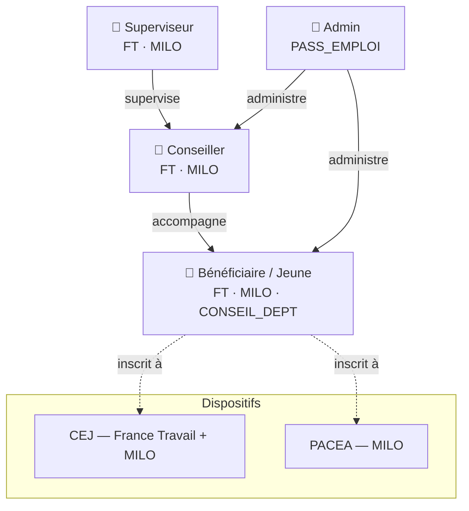

---

## Diagramme 2 — Flux d'authentification

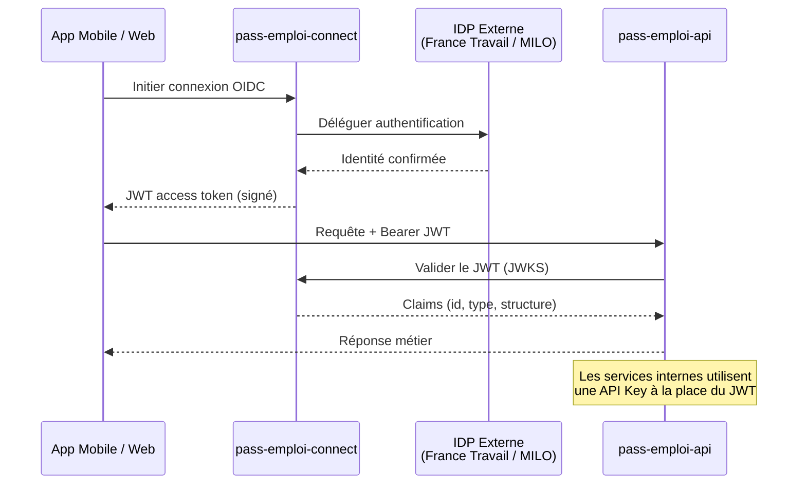

---

## Diagramme 3 — Matrice acteurs × domaines

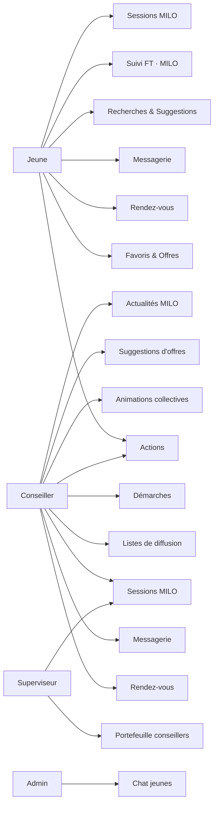

---

## Diagramme 4 — Mindmap des routes principales

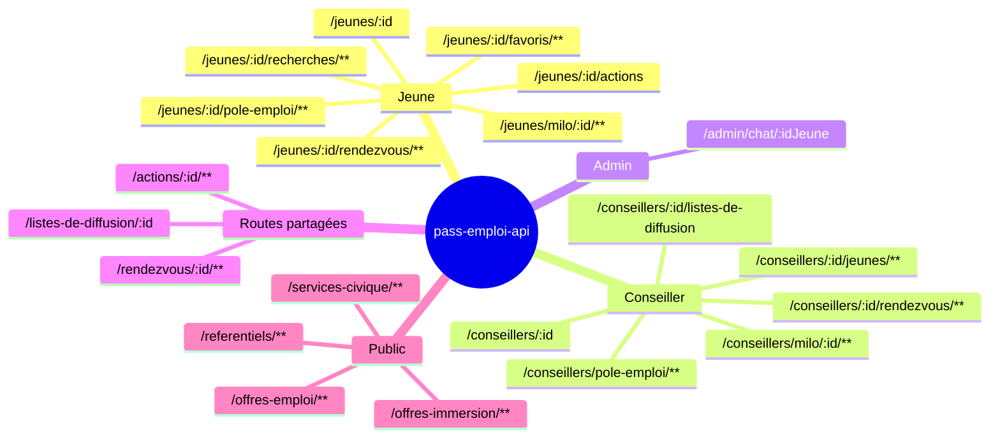

---

## Navigation

| Acteur | Fichier |
|---|---|
| Bénéficiaire / Jeune | [jeune.md](./jeune.md) |
| Conseiller | [conseiller.md](./conseiller.md) |
| Superviseur | [superviseur.md](./superviseur.md) |
| Admin | [admin.md](./admin.md) |
````

- [ ] **Step 2 : Commit**

```bash
git add docs/actors/README.md
git commit -m "docs: acteurs README avec diagrammes macro"
```

---

### Task 2 : `docs/actors/jeune.md` — Bénéficiaire

**Files:**
- Create: `docs/actors/jeune.md`

Sources extraites de :
- `src/infrastructure/routes/jeunes.controller.ts` (`@Controller('jeunes')`)
- `src/infrastructure/routes/jeunes.milo.controller.ts` (`@Controller('jeunes')`)
- `src/infrastructure/routes/jeunes.pole-emploi.controller.ts` (`@Controller()`)
- `src/infrastructure/routes/favoris.controller.ts`
- `src/infrastructure/routes/recherches-jeunes.controller.ts`
- `src/infrastructure/routes/actions.controller.ts` (routes `/jeunes/`)
- `src/infrastructure/routes/rendez-vous.controller.ts` (routes `/jeunes/`)

- [ ] **Step 1 : Créer `docs/actors/jeune.md`**

````markdown
# Bénéficiaire / Jeune

## Qui est-il ?

Le jeune (bénéficiaire) est l'utilisateur principal de **l'application mobile Flutter**.
Il est inscrit à un dispositif d'accompagnement (CEJ ou PACEA) et est suivi par un conseiller.

Selon sa structure d'appartenance, il a accès à des fonctionnalités différentes :
- **FT (POLE_EMPLOI)** : démarches, CV, accueil France Travail
- **MILO** : sessions, actualités, accueil MILO

---

## Diagramme de capacités

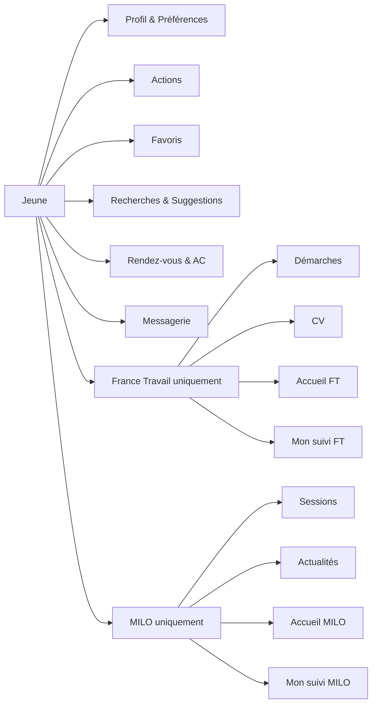

---

## Routes

### Profil & Configuration

| Méthode | Endpoint | Description |
|---|---|---|
| `GET` | `/jeunes/:idJeune` | Récupérer le détail d'un jeune |
| `PATCH` | `/jeunes/:idJeune` | Mettre à jour les infos du jeune |
| `GET` | `/jeunes/:idJeune/preferences` | Récupérer les préférences du jeune |
| `PUT` | `/jeunes/:idJeune/preferences` | Mettre à jour les préférences |
| `PUT` | `/jeunes/:idJeune/configuration-application` | Configurer l'application mobile (push token, etc.) |
| `GET` | `/jeunes/:idJeune/conseillers` | Récupérer les conseillers du jeune |
| `GET` | `/jeunes/:idJeune/notifications` | Récupérer les notifications du jeune |
| `GET` | `/jeunes/:idJeune/comptage` | Récupérer le comptage des activités |

### Actions

| Méthode | Endpoint | Description |
|---|---|---|
| `GET` | `/jeunes/:idJeune/actions` | Lister les actions du jeune |
| `POST` | `/jeunes/:idJeune/action` | Créer une nouvelle action |
| `GET` | `/jeunes/:idJeune/home/agenda` | Récupérer l'agenda (page d'accueil) |

### Favoris & Offres

| Méthode | Endpoint | Description |
|---|---|---|
| `GET` | `/jeunes/:idJeune/favoris` | Récupérer tous les favoris |
| `GET` | `/jeunes/:idJeune/favoris/offres-emploi` | Favoris offres d'emploi |
| `GET` | `/jeunes/:idJeune/favoris/offres-immersion` | Favoris immersions |
| `GET` | `/jeunes/:idJeune/favoris/services-civique` | Favoris services civique |
| `GET` | `/jeunes/:idJeune/favoris/metadonnees` | Métadonnées des favoris |
| `POST` | `/jeunes/:idJeune/favoris/offres-emploi` | Ajouter un favori offre emploi |
| `POST` | `/jeunes/:idJeune/favoris/offres-immersion` | Ajouter un favori immersion |
| `POST` | `/jeunes/:idJeune/favoris/services-civique` | Ajouter un favori service civique |
| `PATCH` | `/jeunes/:idJeune/favoris/offres-emploi/:idOffre` | Mettre à jour un favori emploi |
| `PATCH` | `/jeunes/:idJeune/favoris/offres-immersion/:idOffre` | Mettre à jour un favori immersion |
| `PATCH` | `/jeunes/:idJeune/favoris/service-civique/:idOffre` | Mettre à jour un favori service civique |
| `DELETE` | `/jeunes/:idJeune/favoris/offres-emploi/:idOffreEmploi` | Supprimer un favori emploi |
| `DELETE` | `/jeunes/:idJeune/favoris/offres-immersion/:idOffreImmersion` | Supprimer un favori immersion |
| `DELETE` | `/jeunes/:idJeune/favoris/services-civique/:idOffre` | Supprimer un favori service civique |

### Recherches & Suggestions

| Méthode | Endpoint | Description |
|---|---|---|
| `GET` | `/jeunes/:idJeune/recherches` | Lister les recherches sauvegardées |
| `POST` | `/jeunes/:idJeune/recherches/offres-emploi` | Sauvegarder une recherche emploi |
| `POST` | `/jeunes/:idJeune/recherches/immersions` | Sauvegarder une recherche immersion |
| `POST` | `/jeunes/:idJeune/recherches/services-civique` | Sauvegarder une recherche service civique |
| `DELETE` | `/jeunes/:idJeune/recherches/:idRecherche` | Supprimer une recherche |
| `GET` | `/jeunes/:idJeune/recherches/suggestions` | Récupérer les suggestions du conseiller |
| `POST` | `/jeunes/:idJeune/recherches/suggestions/:idSuggestion/accepter` | Accepter une suggestion |
| `POST` | `/jeunes/:idJeune/recherches/suggestions/:idSuggestion/refuser` | Refuser une suggestion |

### Rendez-vous & Messagerie

| Méthode | Endpoint | Description |
|---|---|---|
| `GET` | `/jeunes/:idJeune/rendezvous/:idRendezVous` | Détail d'un rendez-vous |
| `GET` | `/jeunes/:idJeune/animations-collectives` | Lister les animations collectives |
| `GET` | `/jeunes/:idJeune/messages` | Rechercher dans les messages |

### France Travail uniquement

| Méthode | Endpoint | Description |
|---|---|---|
| `GET` | `/jeunes/:idJeune/pole-emploi/accueil` | Page d'accueil France Travail |
| `GET` | `/jeunes/:idJeune/pole-emploi/cv` | CV France Travail |
| `GET` | `/jeunes/:idJeune/pole-emploi/mon-suivi` | Mon suivi France Travail |
| `GET` | `/jeunes/:idJeune/pole-emploi/idp-token` | Token IDP France Travail |
| `GET` | `/v2/jeunes/:idJeune/home/demarches` | Démarches (page d'accueil v2) |
| `GET` | `/v2/jeunes/:idJeune/home/agenda/pole-emploi` | Agenda FT (page d'accueil v2) |
| `POST` | `/jeunes/:idJeune/demarches` | Créer une démarche |
| `POST` | `/jeunes/:idJeune/demarches-ia` | Créer des démarches via IA |
| `PUT` | `/jeunes/:idJeune/demarches/:idDemarche/statut` | Mettre à jour le statut d'une démarche |

### MILO uniquement

| Méthode | Endpoint | Description |
|---|---|---|
| `GET` | `/jeunes/:idJeune/milo/accueil` | Page d'accueil MILO |
| `GET` | `/jeunes/milo/:idJeune/mon-suivi` | Mon suivi MILO |
| `GET` | `/jeunes/milo/:idJeune/actualites` | Actualités MILO |
| `GET` | `/jeunes/milo/:idJeune/sessions` | Lister les sessions disponibles |
| `GET` | `/jeunes/milo/:idJeune/sessions/:idSession` | Détail d'une session |
| `POST` | `/jeunes/milo/:idBeneficiaire/sessions/:idSession/inscrire` | S'inscrire à une session |
| `POST` | `/jeunes/milo/:idBeneficiaire/sessions/:idSession/desinscrire` | Se désinscrire d'une session |

---

## Séquence : Consulter mon suivi

Flux déclenché par `GET /jeunes/milo/:idJeune/mon-suivi` ou `GET /jeunes/:idJeune/pole-emploi/mon-suivi`.

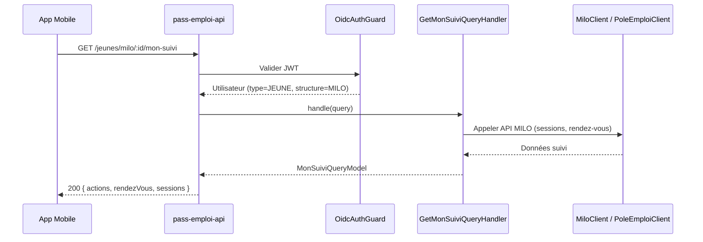
````

- [ ] **Step 2 : Commit**

```bash
git add docs/actors/jeune.md
git commit -m "docs: acteur jeune — routes et diagrammes"
```

---

### Task 3 : `docs/actors/conseiller.md` — Conseiller

**Files:**
- Create: `docs/actors/conseiller.md`

Sources extraites de :
- `src/infrastructure/routes/conseillers.controller.ts` (`@Controller('conseillers')`)
- `src/infrastructure/routes/conseillers.milo.controller.ts` (`@Controller('conseillers/milo')`)
- `src/infrastructure/routes/conseillers.pole-emploi.controller.ts` (`@Controller('conseillers/pole-emploi')`)
- `src/infrastructure/routes/recherches-conseillers.controller.ts` (`@Controller('conseillers/:idConseiller')`)
- `src/infrastructure/routes/actions.controller.ts` (routes `/conseillers/`)
- `src/infrastructure/routes/rendez-vous.controller.ts` (routes `/conseillers/`)
- `src/infrastructure/routes/listes-de-diffusion.controller.ts`

- [ ] **Step 1 : Créer `docs/actors/conseiller.md`**

````markdown
# Conseiller

## Qui est-il ?

Le conseiller est le professionnel qui accompagne les bénéficiaires. Il utilise **l'application web Next.js**.
Il appartient à une structure (France Travail ou Mission Locale) et gère un portefeuille de jeunes.

Deux profils distincts selon la structure :
- **France Travail (POLE_EMPLOI)** : démarches, suggestions d'offres, suivi FT
- **MILO** : sessions, animations collectives, actualités, qualification d'actions

---

## Diagramme de capacités

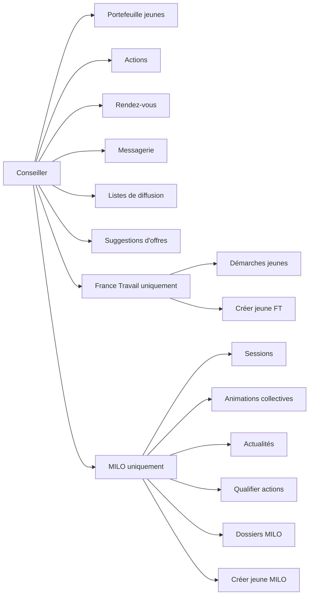

---

## Routes

### Gestion du portefeuille

| Méthode | Endpoint | Description |
|---|---|---|
| `GET` | `/conseillers` | Rechercher des conseillers (par email ou nom) |
| `GET` | `/conseillers/:idConseiller` | Détail d'un conseiller |
| `PUT` | `/conseillers/:idConseiller` | Modifier les informations du conseiller |
| `DELETE` | `/conseillers/:idConseiller` | Supprimer un conseiller |
| `GET` | `/conseillers/:idConseiller/jeunes` | Lister les jeunes du portefeuille |
| `GET` | `/conseillers/:idConseiller/jeunes/comptage` | Comptage des jeunes |
| `GET` | `/conseillers/:idConseiller/jeunes/identites` | Identités des jeunes (nom, prénom) |
| `GET` | `/conseillers/:idConseiller/jeunes/:idJeune/indicateurs` | Indicateurs d'un jeune |
| `PATCH` | `/conseillers/:idConseiller/jeunes/:idJeune` | Modifier les données d'un jeune |
| `POST` | `/conseillers/:idConseiller/jeunes/:idJeune/changer-dispositif` | Changer le dispositif d'un jeune |
| `POST` | `/conseillers/:idConseiller/recuperer-mes-jeunes` | Récupérer ses jeunes (après transfert) |
| `POST` | `/conseillers/:idConseiller/envoyer-email-activation/:idJeune` | Envoyer l'email d'activation à un jeune |

### Actions

| Méthode | Endpoint | Description |
|---|---|---|
| `POST` | `/conseillers/:idConseiller/jeunes/:idJeune/action` | Créer une action pour un jeune |
| `GET` | `/v2/conseillers/:idConseiller/actions` | Lister les actions du portefeuille (v2) |
| `GET` | `/actions/:idAction` | Détail d'une action |
| `PUT` | `/actions/:idAction` | Mettre à jour une action |
| `DELETE` | `/actions/:idAction` | Supprimer une action |
| `POST` | `/actions/:idAction/qualifier` | Qualifier une action |
| `POST` | `/actions/:idAction/commentaires` | Ajouter un commentaire à une action |
| `GET` | `/actions/:idAction/commentaires` | Lister les commentaires d'une action |

### Rendez-vous

| Méthode | Endpoint | Description |
|---|---|---|
| `POST` | `/conseillers/:idConseiller/rendezvous` | Créer un rendez-vous |
| `GET` | `/v2/conseillers/:idConseiller/rendezvous` | Lister les rendez-vous (v2) |
| `GET` | `/conseillers/:idConseiller/rendezvous/a-clore` | Lister les rendez-vous à clore |
| `GET` | `/conseillers/:idConseiller/jeunes/:idJeune/rendezvous` | RDV d'un jeune du portefeuille |
| `GET` | `/rendezvous/:idRendezVous` | Détail d'un rendez-vous |
| `PUT` | `/rendezvous/:idRendezVous` | Modifier un rendez-vous |
| `DELETE` | `/rendezvous/:idRendezVous` | Supprimer un rendez-vous |
| `POST` | `/rendezvous/:idRendezVous/clore` | Clore un rendez-vous |

### Messagerie

| Méthode | Endpoint | Description |
|---|---|---|
| `POST` | `/conseillers/:idConseiller/jeunes/notify-messages` | Envoyer des notifications de messages |

### Listes de diffusion

| Méthode | Endpoint | Description |
|---|---|---|
| `POST` | `/conseillers/:idConseiller/listes-de-diffusion` | Créer une liste de diffusion |
| `GET` | `/conseillers/:idConseiller/listes-de-diffusion` | Lister les listes de diffusion |
| `GET` | `/listes-de-diffusion/:idListeDeDiffusion` | Détail d'une liste |
| `PUT` | `/listes-de-diffusion/:idListeDeDiffusion` | Modifier une liste |
| `DELETE` | `/listes-de-diffusion/:idListeDeDiffusion` | Supprimer une liste |

### Suggestions d'offres

| Méthode | Endpoint | Description |
|---|---|---|
| `POST` | `/conseillers/:idConseiller/recherches/suggestions/offres-emploi` | Suggérer des offres emploi à un jeune |
| `POST` | `/conseillers/:idConseiller/recherches/suggestions/immersions` | Suggérer des immersions à un jeune |
| `POST` | `/conseillers/:idConseiller/recherches/suggestions/services-civique` | Suggérer des services civique |

### France Travail uniquement

| Méthode | Endpoint | Description |
|---|---|---|
| `POST` | `/conseillers/pole-emploi/jeunes` | Créer un jeune France Travail |
| `POST` | `/conseillers/pole-emploi/verifier-email-beneficiaire` | Vérifier l'email d'un bénéficiaire |
| `GET` | `/conseillers/:idConseiller/jeunes/:idJeune/demarches` | Démarches d'un jeune |

### MILO uniquement

| Méthode | Endpoint | Description |
|---|---|---|
| `POST` | `/conseillers/milo/jeunes` | Créer un jeune MILO |
| `GET` | `/conseillers/milo/dossiers/:idDossier` | Récupérer un dossier MILO |
| `GET` | `/conseillers/milo/jeunes/:idDossier` | Récupérer un jeune MILO par son dossier |
| `GET` | `/conseillers/milo/:idConseiller/sessions` | Lister les sessions du conseiller |
| `GET` | `/conseillers/milo/:idConseiller/agenda/sessions` | Agenda des sessions |
| `GET` | `/conseillers/milo/:idConseiller/sessions/:idSession` | Détail d'une session |
| `PATCH` | `/conseillers/milo/:idConseiller/sessions/:idSession` | Modifier la visibilité d'une session |
| `POST` | `/conseillers/milo/:idConseiller/sessions/:idSession/cloturer` | Clôturer une session (émargement) |
| `POST` | `/conseillers/milo/actions/qualifier` | Qualifier des actions en lot |
| `GET` | `/conseillers/milo/:idConseiller/compteurs-portefeuille` | Compteurs du portefeuille MILO |
| `POST` | `/conseillers/milo/:idConseiller/actualites` | Créer une actualité MILO |
| `GET` | `/conseillers/milo/:idConseiller/actualites` | Lister les actualités MILO |
| `PUT` | `/conseillers/milo/:idConseiller/actualites/:idActualite` | Modifier une actualité MILO |
| `DELETE` | `/conseillers/milo/:idConseiller/actualites/:idActualite` | Supprimer une actualité MILO |

---

## Séquence : Créer une action pour un jeune

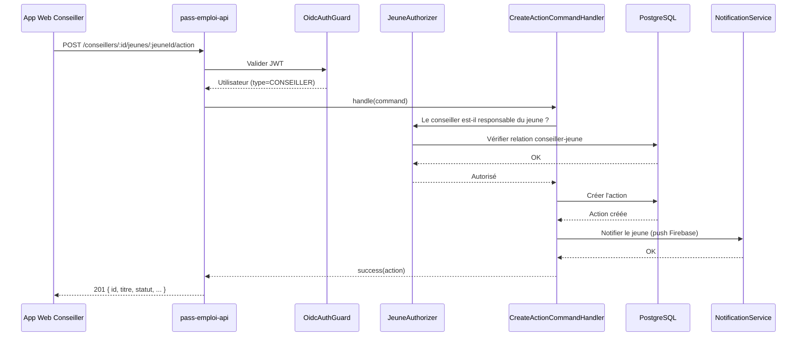
````

- [ ] **Step 2 : Commit**

```bash
git add docs/actors/conseiller.md
git commit -m "docs: acteur conseiller — routes et diagrammes"
```

---

### Task 4 : `docs/actors/superviseur.md` — Superviseur

**Files:**
- Create: `docs/actors/superviseur.md`

Sources : `conseillers.controller.ts`, `conseillers.milo.controller.ts`, `structures.milo.controller.ts`.
Le superviseur partage les routes du conseiller mais avec un périmètre élargi (accès multi-conseillers).

- [ ] **Step 1 : Créer `docs/actors/superviseur.md`**

````markdown
# Superviseur

## Qui est-il ?

Le superviseur supervise plusieurs conseillers au sein d'une même structure. Il utilise **l'application web Next.js**.
Il n'a pas de portefeuille de jeunes propre : il accède aux données de ses conseillers supervisés.

---

## Diagramme de capacités

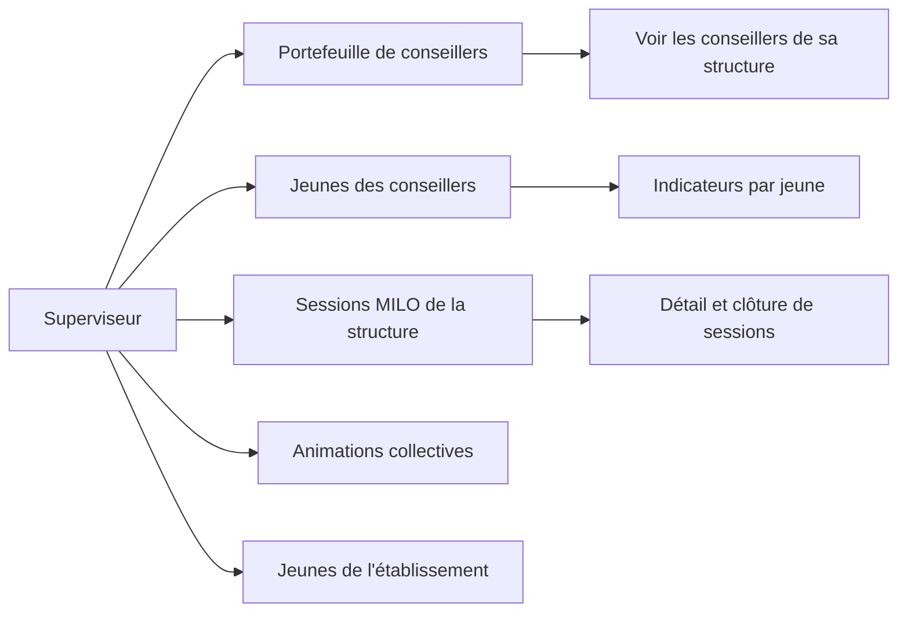

---

## Routes

### Supervision des conseillers

| Méthode | Endpoint | Description |
|---|---|---|
| `GET` | `/conseillers` | Rechercher des conseillers dans sa structure |
| `GET` | `/conseillers/:idConseiller` | Détail d'un conseiller supervisé |
| `GET` | `/conseillers/:idConseiller/jeunes` | Jeunes du portefeuille d'un conseiller |
| `GET` | `/conseillers/:idConseiller/jeunes/comptage` | Comptage des jeunes d'un conseiller |
| `GET` | `/conseillers/:idConseiller/jeunes/:idJeune/indicateurs` | Indicateurs d'un jeune |

### Sessions MILO (superviseur MILO uniquement)

| Méthode | Endpoint | Description |
|---|---|---|
| `GET` | `/conseillers/milo/:idConseiller/sessions` | Sessions d'un conseiller supervisé |
| `GET` | `/conseillers/milo/:idConseiller/sessions/:idSession` | Détail d'une session |
| `GET` | `/conseillers/milo/:idConseiller/compteurs-portefeuille` | Compteurs du portefeuille d'un conseiller |
| `GET` | `/structures-milo/:idStructureMilo/jeunes` | Tous les jeunes de la structure MILO |
| `POST` | `/structures-milo/animations-collectives/:idAnimationCollective/cloturer` | Clôturer une animation collective |

---

## Séquence : Consulter le portefeuille d'un conseiller

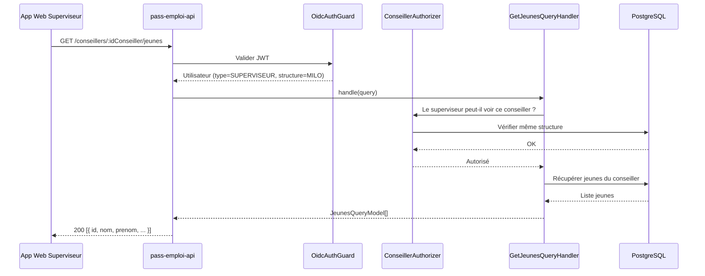
````

- [ ] **Step 2 : Commit**

```bash
git add docs/actors/superviseur.md
git commit -m "docs: acteur superviseur — routes et diagrammes"
```

---

### Task 5 : `docs/actors/admin.md` — Admin

**Files:**
- Create: `docs/actors/admin.md`

Source : `src/infrastructure/routes/admin.controller.ts` (`@Controller('admin')`, `@UseGuards(ApiKeyAuthGuard)`).

- [ ] **Step 1 : Créer `docs/actors/admin.md`**

````markdown
# Admin

## Qui est-il ?

L'admin représente les services internes de l'équipe pass-emploi (scripts, outils, support).
Il n'utilise **pas de JWT OIDC** : l'authentification se fait via une **API Key** transmise dans le header `Authorization: Bearer <key>`.

La clé est stockée dans les variables d'environnement (via `ConfigService`, jamais en dur).

---

## Diagramme de capacités

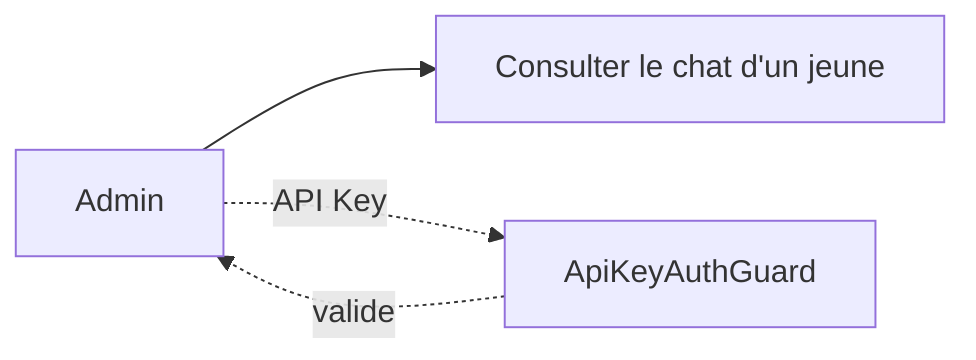

---

## Routes

| Méthode | Endpoint | Description |
|---|---|---|
| `GET` | `/admin/chat/:idJeune` | Récupérer les informations de chat d'un jeune (secrets Firebase) |

> Ces routes sont protégées par `ApiKeyAuthGuard` (pas OIDC). L'accès est réservé aux outils internes.

---

## Séquence : Consulter le chat d'un jeune

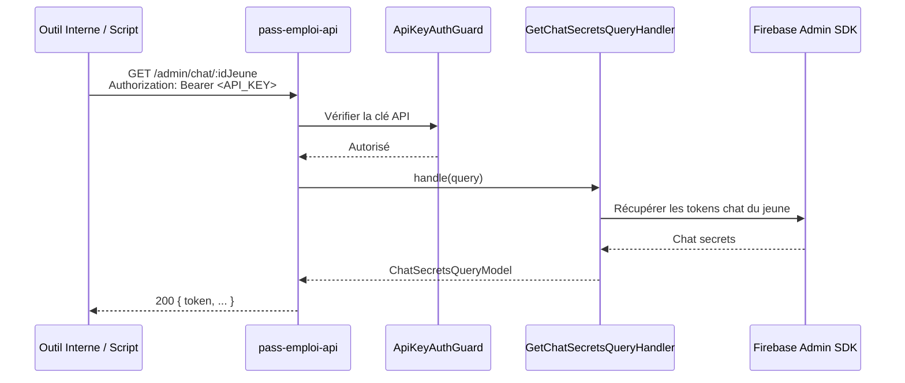
````

- [ ] **Step 2 : Commit**

```bash
git add docs/actors/admin.md
git commit -m "docs: acteur admin — routes et diagrammes"
```
